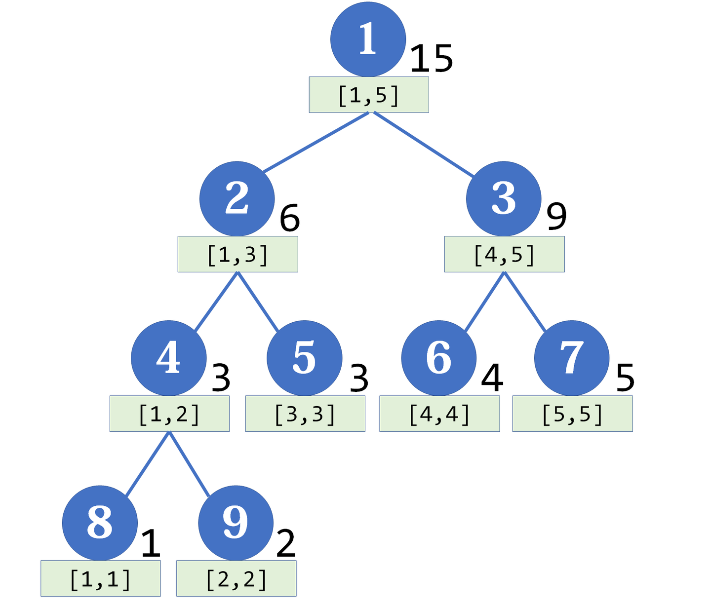

## 功能

用于**维护区间信息**（要求满足结合律），可以实现 O(logn) 的**区间修改**和**查询一段区间的值**，同时也支持加、乘多种操作

## 结构

是平衡二叉树，母结点代表整个区间和，是其两个子结点的和，每个节点对应一个线段（区间）



> 用静态完全二叉树数组（从 1 开始数）的结构存储方式：结点 p 的左右子节点编号为 2p、2p+1，一般空间要 4 倍

若节点 p 储存区间 $[a,b]$ 和，设 $mid=\lfloor\frac{a+b}{2}\rfloor$，则两个子结点恰好储存区间 $[a,mid]$、$[mid,b]$ 和。可以注意到**左节点对应的区间长度比右区间大 1 或相同**

## 代码

#### 建树
通过递归的方式，先左后右，深度优先：
```cpp
const int MAXN = 1e5+5;
array<int,MAXN> dat;
array<int,MAXN<<2> tree;
int n;

void build(int back=n,int front=1,int p=1)
{
    if (front == back) return void(tree[p] = dat[front]);
    int mid = (front + back) >> 1;
    build(mid,front,p << 1);
    build(back,mid+1,p << 1 | 1);
    tree[p] = tree[p << 1] + tree[p << 1 | 1];
}
```

#### 区间修改
**懒标记**是线段树的精髓，是复杂度 O(logn) 的原因。对于区间修改中那些正好是线段树节点的区间，不选择继续递归下去，而是打上 Tag，将来要用到其子区间时再向下传递

更新时，从最大区间开始递归向下处理。**任何区间是线段树上某些节点的并集**，于是记目标区间为 $[l,r]$，当前区间为 $[cl,cr]$，当前节点为 p，有下面三种情况：

1. **当前区间与目标区间无交集**
	这时直接结束递归

2. **当前区间被包括在目标区间内**
	此时可以更新区间并打上懒标记（叶子节点可以不打）
	`tree[p]+=(cr-cl+1)*d;`
	`mark[p]+=d;` 此标记表示区间上每点加上 d

3. **当前区间与目标区间相交不包含**
	此时把当前区间分为两部分，如果存在懒标记要将标记
	传给子结点
	`int mid=(cl+cr)>>1;`
	`mark[p<<1]+=mark[p];`
	`mark[p<<1|1]+=mark[p];`
	两个子结点值也需要相应更新
	`tree[p<<1]+=mark[p]*(mid-cl+1);`
	`tree[p<<1|1]+=mark[p]*(cr-mid);`
	最后清除该节点的懒标记
	`mark[p]=0;`
	此过程并不递归，可以把过程封装为函数 `push_down`

```cpp
void push_down(int p,int len)
{
    if (len <= 1) return;
    tree[p << 1] += mark[p] * (len - len / 2);
    mark[p << 1] += mark[p];
    tree[p << 1 | 1] += mark[p] * (len / 2);
    mark[p << 1 | 1] += mark[p];
    mark[p] = 0;
}
```

```cpp
void update(int l,int r,int d,int p = 1,int cl = 1,int cr = n)
{
    if (cl >= l && cr <= r) 
    	return void(tree[p] += d * (cr - cl + 1), mark[p] += d);
    push_down(p, cr - cl + 1);
    int mid = (cl + cr) >> 1;
    if (mid >= l) update(l, r, d, p << 1, cl, mid);
    if (mid < r) update(l, r, d, p << 1 | 1, mid + 1, cr);
    tree[p] = tree[p << 1] + tree[p << 1 | 1];
}
```

#### 区间查询
类似上面的修改
```cpp
int query(int l,int r,int p = 1,int cl = 1,int cr = n)
{
    if (cl >= l && cr <= r) return tree[p];
    push_down(p, cr - cl + 1);
    int mid = (cl + cr) >> 1, ans = 0;
    if (mid >= l) ans += query(l, r, p << 1, cl, mid);
    if (mid < r) ans += query(l, r, p << 1 | 1, mid + 1, cr);
    return ans;
}
```