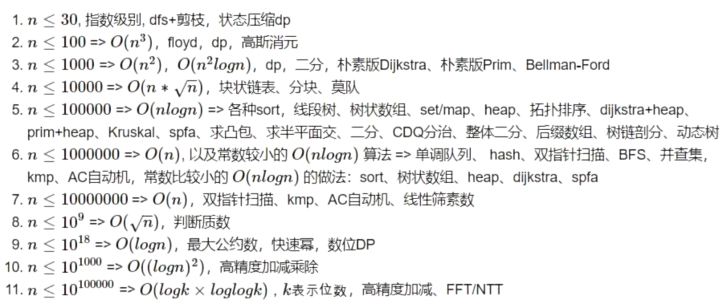

通用的经验是，1s能跑的数据量N为：
1e8(C++)、1e6--5e6(Python)

> [!NOTE]
> C++如果超过 1e9 一般就会超时了

C++参考：
*O(n)*           1e8
*O(nlogn)*    1e6--1e7
*O(n^2)*       1e4--3e4
*O(n^3)*       1e3

Python参考：
*O(n)*           1e6--5e6
*O(nlogn)*    1e5--2e5
*O(n^2)*       3e3--5e3
*O(n^3)*       3e2--5e2

C++运行时普遍快于Python十倍左右，下面只看C++：
<12     *O(n!)*
<30     *O(2^n)*
<500   *O(n^3)*
<1e4   *O(n^2)*
<1e5   *O(nsqrt{n})*
<1e6   *O(nlogn)*
<1e8   *O(n)*

试题中根据样本N的范围估计算法通过的复杂度

