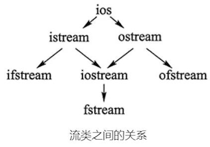

进行数据输入输出的类统称为*流类*

其中的菱形继承就用到虚继承

`<ostream>`定义四个标准流对象：`cin、cout、cerr、clog`

## 标准IO

| 对象     | 功能   | 特点               |
| ------ | ---- | ---------------- |
| `cin`  | 标准输入 | 从键盘读取，可重定向为从文件读取 |
| `cout` | 标准输出 | 输出到屏幕，可重定向为向文件写入 |
| `cerr` | 标准错误 | 必须输出到屏幕，不可重定向    |
| `clog` | 标准错误 | 输出到屏幕，可重定向为向文件写入 |

可在终端重定向：
```powershell
./demo.exe < in.txt > out.txt
```

## cin标准输入流

`get()`可用于获取一个字符 `char ch = cin.get();`或`cin.get(ch);`
	有时不想让`get()`读取`\n`字符，可以用`cin.ignore();`忽略当前一个字符，`ignore(n,ch)`可以有两个参数，第一个n表示最多忽略n个字符，第二个ch表示遇到这个字符就停止忽略（该字符也会被忽略），如`cin.ignore(1,'\n');`

`get(buf,n,ch)`也有三参数，buf可以为多元素的数组等，n表示读取的字符最大个数，读到ch就停止（此时ch不会被读走，留在缓冲区），如`cin.get(arr,100,'\n');`

> [!NOTE]
> 因为直接`cin>>str`读取字符串时不能读取空格，此时可换用`get()`或`getline()`（getline和get差不多，参数一样）

## cout格式控制输出

```cpp
// global 表示该设置全局生效
cout.width(3); // 设置下一次内容所占最小宽度，默认右对齐，空格填充
cout.fill('*'); // 设置填充字符，取代上面width的填充空格 global
cout<<'A'<<endl; // **A

cout.setf(ios::left); // 设置对齐方式，参数可为left、right global
cout.setf(ios::scientific); // 用科学计数法显示浮点数 global
cout.unsetf(ios::scientific); // 取消参数里面的设置 global
cout.precision(3); // 设置浮点数精度，包括整数位 global

cout.setf(ios::showbase); // 显示进制前缀 global
cout.setf(ios::uppercase); // 用大写的方式显示16进制前缀 global
cout.setf(ios::showpos); // 强制显示符号（+ -）
cout.setf(ios::hex); // 以16进制显示整数
cout<<520<<endl;
```
上面的`setf`各参数可以用`|`写在一起（因为是按位），如`cout.setf(ios::showcase|ios::uppercase);`

区别于老式的`setf`写法还可以如下：
```cpp
cout<<left<<hex<<520<<endl;
```
*新式操纵符*：
- 永久生效：`left,right,setfill(ch),fixed,scientific,hex,oct,dec,uppercase`
- 下一次：`setw(n)` 等同`cout.width(n);`

复位新式操作符如`cout<<resetiosflags(ios::fixed);`

用到`left,right,setw,setfill`等要加头文件`<iomanip>`

数字输出控制：
```cpp
// 3位有效数字
cout<<setprecision(3)<<num;

// 3位小数
cout<<fixed<<setprecision(3)<<num;
```

## IO 加速

在算法等场景，使用下面代码可提高 IO 速度：
```cpp
ios::sync_with_stdio(false);
cin.tie(0);
```