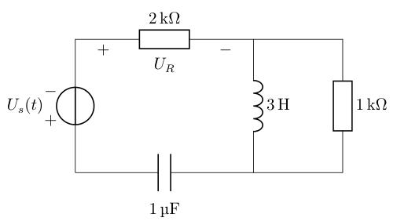

> 如果只需使用基础的绘图命令，可以使用 TikZ 包

使用 CircuiTikZ 包可以在 latex 中绘制电路图或其他有明确流结构的图，比如编译器的流结构

### 风格

circuitikz 包中电路包含欧式风格和美式风格，默认是美式风格

使用 `\usepackage` 导入包时可填入下面可选参数

| 元件  | 欧式风格               | 美式风格               | 其他风格             |
| --- | ------------------ | ------------------ | ---------------- |
| 电压  | europeanvoltages   | americanvoltages   | straightvoltages |
| 电流  | europeancurrents   | americancurrents   |                  |
| 电阻  | europeanresistors  | americanresistors  |                  |
| 电容  | europeancapacitors | americancapacitors |                  |
| 电感  | europeaninductors  | americaninductors  | cuteinductors    |
| 逻辑门 | europeanports      | americanports      |                  |

```latex
\usepackage[
	europeanvoltages,
	europeancurrents,
	europeanresistors,
	europeancapacitors,
]{circuitikz}
```

> [!NOTE]
> 上面可能会有不明编译失败，可以用
> ```latex
> \usepackage[european]{circuitikz}
> \ctikzset{inductor=american}
> ```

#### 国内风格建议

电流、电压使用*欧式* ，电流电压标注、电感、逻辑端子使用*美式*

### 支路

```latex
\draw (startX,startY) to (endX,endY);
```

如果支路上存在元件，则在 `to[]` 的可选参数中填写，对于电阻、电容、电感、电压源等元件，还可用 `=` 标注大小
在一个点处使用 `node[]{}` 来标记节点，必选参数为节点名，可选参数为节点标记的位置或其他设定

```latex
\draw (0,0) node[left]{$A$} to[R={$\SI{2}{\ohm}$}] (2,0) node[right]{$B$};
```

支路可以连续绘制，如果闭合则构成回路，如

```latex
\begin{figure}[htp]
	\small \centering
	\begin{circuitikz}
		\draw (0,0) to[vsource={$U_\mathrm{s}(t)$}] (0,3)
			to[R={$\SI{2}{\kilo\ohm}$},v=$U_\mathrm{R}$,american 					voltages] (4,3)
			to[L={$\SI{3}{\henry}$}] (4,0)
			to[C={$\SI{1}{\micro\farad}$}] (0,0);
		\draw (4,3) to (6,3) to[R] (6,0) to (4,0);
	\end{circuitikz}
\end{figure}
```



#### to 可选参数补充

open 参数表示开路，相当于不去画这条支路

`to[short,*-*]` 中，short 参数缩短支路长度，`*-*` 表示给支路左右两端标黑点，也可以用 `*-` 表示只给左端标点。这个通常表示短路

> [!NOTE]
> 另外，open 参数后可接 `o-o`，表示开路两端标空心圆点


