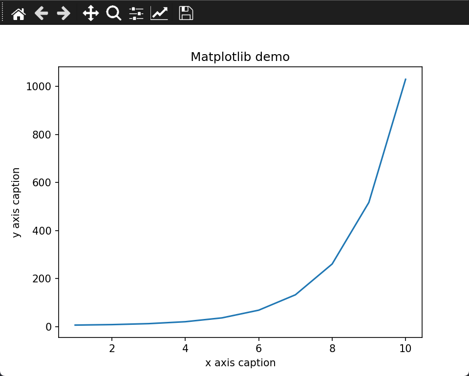
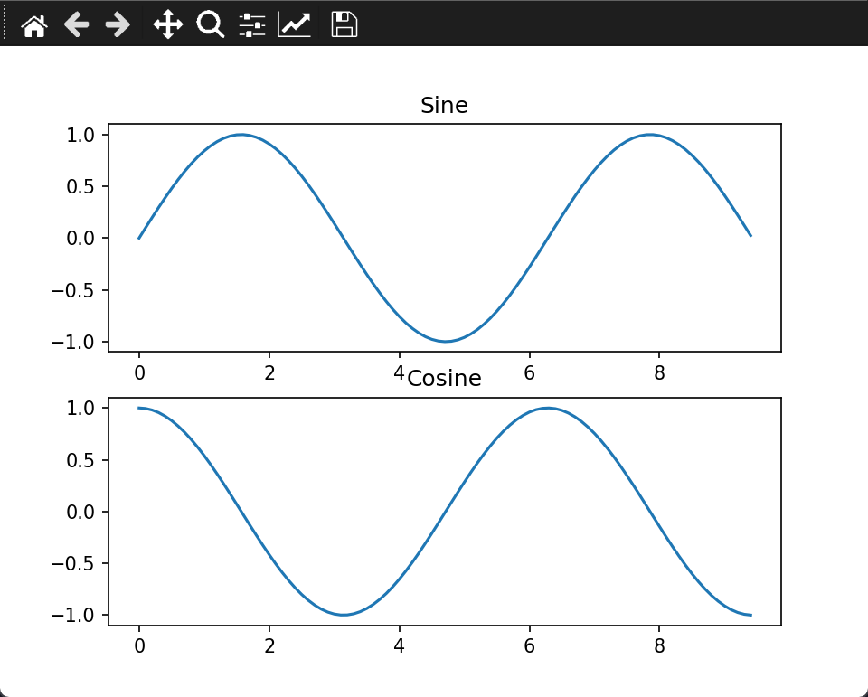

Matplotlib 是 Python 的绘图库，可与 NumPy 一起使用，提供了一种有效的 MatLab 开源替代方案，也可以和图形工具包一起使用，如 PyQt 和 wxPython

> matplotlib 安装：`pip3 install matplotlib -i https://pypi.tuna.tsinghua.edu.cn/simple`

## 例子

```python
import numpy as np 
from matplotlib import pyplot as plt 
 
x = np.arange(1,11) 
y =  2**x +  5 
plt.title("Matplotlib demo") 
plt.xlabel("x axis caption") 
plt.ylabel("y axis caption") 
plt.plot(x,y) 
plt.show()
```



## 加载中文字体方法

以思源字体为例，从[官网](https://source.typekit.com/source-han-serif/cn/)、[GitHub 地址](https://github.com/adobe-fonts/source-han-sans/tree/release/OTF/SimplifiedChinese)中下载.otf 字体放在代码目录下

```python
import numpy as np 
from matplotlib import pyplot as plt 
import matplotlib
 
# fname 为 你下载的字体库路径，注意字体路径
zhfont1 = matplotlib.font_manager.FontProperties(fname="SourceHanSansSC-Bold.otf") 
 
x = np.arange(1,11) 
y =  2  * x +  5 
plt.title("测试", fontproperties=zhfont1) 
 
# fontproperties 设置中文显示，fontsize 设置字体大小
plt.xlabel("x 轴", fontproperties=zhfont1)
plt.ylabel("y 轴", fontproperties=zhfont1)
plt.plot(x,y) 
plt.show()
```

也可以使用系统已有的字体：
```python
from matplotlib import pyplot as plt
import matplotlib
a=sorted([f.name for f in matplotlib.font_manager.fontManager.ttflist])

for i in a:
    print(i)
```
打印出 font_manager 的 ttflist 中所有注册的名字，如 STFangsong，添加下面代码
`plt.rcParams['font.family']=['STFangsong']`

## 显示格式

作为线性图的替代，可以通过向 plot() 函数添加格式字符串来显示离散值

|字符|描述|
|---|---|
| `'-'` |实线样式|
| `'--'` |短横线样式|
| `'-.'` |点划线样式|
| `':'` |虚线样式|
| `'.'` |点标记|
| `','` |像素标记|
| `'o'` |圆标记|
| `'v'` |倒三角标记|
| `'^'` |正三角标记|
| `'&lt;'` |左三角标记|
| `'&gt;'` |右三角标记|
| `'1'` |下箭头标记|
| `'2'` |上箭头标记|
| `'3'` |左箭头标记|
| `'4'` |右箭头标记|
| `'s'` |正方形标记|
| `'p'` |五边形标记|
| `'*'` |星形标记|
| `'h'` |六边形标记 1|
| `'H'` |六边形标记 2|
| `'+'` |加号标记|
| `'x'` |X 标记|
| `'D'` |菱形标记|
| `'d'` |窄菱形标记|
| `'&#124;'` |竖直线标记|
| `'_'` |水平线标记|
以及颜色：

|字符|颜色|
|---|---|
| `'b'` |蓝色|
| `'g'` |绿色|
| `'r'` |红色|
| `'c'` |青色|
| `'m'` |品红色|
| `'y'` |黄色|
| `'k'` |黑色|
| `'w'` |白色|

```python
import numpy as np 
from matplotlib import pyplot as plt 
 
x = np.arange(1,11) 
y =  2  * x +  5 
plt.title("Matplotlib demo") 
plt.xlabel("x axis caption") 
plt.ylabel("y axis caption") 
plt.plot(x,y,"ob") 
plt.show()
```
表示用蓝色圆点替代上面实例中的线

## subplot
subplot() 函数可以在同一图中绘制不同的图像
下面实例绘制正弦和余弦：
```python
import numpy as np 
import matplotlib.pyplot as plt 
# 计算正弦和余弦曲线上的点的 x 和 y 坐标 
x = np.arange(0,  3  * np.pi,  0.1) 
y_sin = np.sin(x) 
y_cos = np.cos(x)  
# 建立 subplot 网格，高为 2，宽为 1  
# 激活第一个 subplot
plt.subplot(2,  1,  1)  
# 绘制第一个图像 
plt.plot(x, y_sin) 
plt.title('Sine')  
# 将第二个 subplot 激活，并绘制第二个图像
plt.subplot(2,  1,  2) 
plt.plot(x, y_cos) 
plt.title('Cosine')  
# 展示图像
plt.show()
```



## bar
pyplot 子模块提供 bar() 函数来生成条形图
下面实例生成 x,y 两个数组的条形图

```python
from matplotlib import pyplot as plt 
x =  [5,8,10] 
y =  [12,16,6] 
x2 =  [6,9,11] 
y2 =  [6,15,7] 
plt.bar(x, y, align =  'center') 
plt.bar(x2, y2, color =  'g', align =  'center') 
plt.title('Bar graph') 
plt.ylabel('Y axis') 
plt.xlabel('X axis') 
plt.show()
```