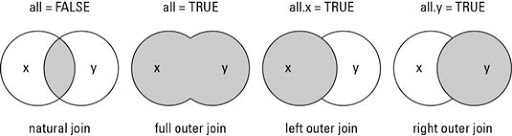
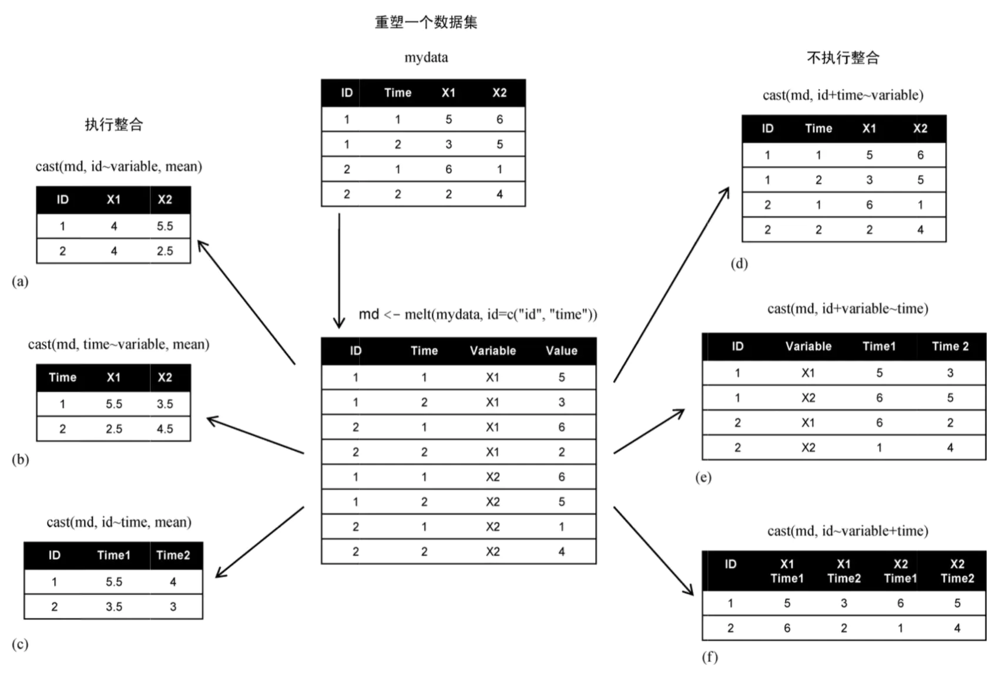

### 因子

因子用于存储不同类别的数据类型，如人的性别、国籍，语法为：
```R
factor(x = character(), levels, labels = levels,
       exclude = NA, ordered = is.ordered(x), nmax = NA)
```
- **x**：向量
- **levels**：指定各水平值, 不指定时由 x 的不同值来求得
- **labels**：水平的标签, 不指定时用各水平值的对应字符串
- **exclude**：排除的字符
- **ordered**：逻辑值，用于指定水平是否有序
- **nmax**：水平的上限数量

添加因子水平标签 labels 时要与 levels 参数的字符顺序保持一致，如：
```R
sex <- factor(c('f','m','f','f'),levels=c('f','m'),
	labels=c('female','male'),ordered=TRUE)
print(sex)
# [1] female male   female female male  
# Levels: female < male
```

使用 gl() 来生成因子水平，语法：
```R
gl(n, k, length = n*k, labels = seq_len(n), ordered = FALSE)
```
- **n**: 设置 level 的个数
- **k**: 设置每个 level 重复的次数
- **length**: 设置长度
- **labels**: 设置 level 的值
- **ordered**: 设置是否 level 是排列好顺序的，布尔值

例子：
```R
v <- gl(3, 4, labels = c("a", "b", "c"))
print(v)
# [1] a a a a b b b b c c
# [11] c c
# Levels: a b c
```

### 数据框

数据框即表格，每列有唯一列名且长度相等，同一列数据类型需一致，不同列数据类型可不一样，创建语法：
```R
data.frame(…, row.names = NULL, check.rows = FALSE,
           check.names = TRUE, fix.empty.names = TRUE,
           stringsAsFactors = default.stringsAsFactors())
```
- **…**: 列向量，可以是任何类型（字符型、数值型、逻辑型），一般以 tag = value 的形式表示，也可以是 value
- **row.names**: 行名，默认为 NULL，可以设置为单个数字、字符串或字符串和数字的向量
- **check.rows**: 检测行的名称和长度是否一致
- **check.names**: 检测数据框的变量名是否合法
- **fix.empty.names**: 设置未命名的参数是否自动设置名字
- **stringsAsFactors**: 布尔值，字符是否转换为因子，factory-fresh 的默认值是 TRUE，可以通过设置选项（stringsAsFactors=FALSE）来修改

例子：
```R
tb <- data.frame(
    name = c("sam", "gt"),
    flag = c("1", "2"),
    fee = c(1, 2)
)
```

打印查看 `print(tb)`
```R
  name flag fee
1  sam    1   1
2   gt    2   2
```

打印数据结构 `str(tb)`
```R
'data.frame':   2 obs. of  3 variables:
 $ name: chr  "sam" "gt"
 $ flag: chr  "1" "2"
 $ fee : num  1 2
```

显示数据框摘要 `summary(tb)`
```R
       name          flag        fee      
Length   :2   Length   :2   Min.   :1.00  
N.unique :2   N.unique :2   1st Qu.:1.25  
N.blank  :0   N.blank  :0   Median :1.50  
Min.nchar:2   Min.nchar:1   Mean   :1.50  
Max.nchar:3   Max.nchar:1   3rd Qu.:1.75  
                            Max.   :2.00 
```

截取指定列
```R
res <- data.frame(tb$flag, tb$fee)

res2 <- table[1:2,] # 前两行
```

> 数据框的索引方法可以像数组一样使用广播机制

添加列：
```R
tb$new <- c("a", "b")
print(tb)
```

#### 向量合成数据框
```R
name <- c("sa", "g")
flag <- c("3", "4")
tb2 <- cbind(name, flag)
print(tb2)
```

#### 多个数据框合成
列信息必须一样，没有添加新的列
```R
tb3 <- rbind(tb[1:2], tb2)
print(tb3)
```

#### 多个数据框合并
语法：
```R
merge(x, y, by = intersect(names(x), names(y)),
      by.x = by, by.y = by, all = FALSE, all.x = all, all.y = all,
      sort = TRUE, suffixes = c(".x",".y"), no.dups = TRUE,
      incomparables = NULL, …)
```
- `x, y`： 数据框
- `by, by.x, by.y`：指定两个数据框中匹配列名称，默认情况下使用两个数据框中相同列名称
- `all`：逻辑值; all = L 是 all.x = L 和 all.y = L 的简写，L 可以是 TRUE 或 FALSE
- `all.x`：逻辑值，默认为 FALSE。如果为 TRUE, 显示 x 中匹配的行，即便 y 中没有对应匹配的行，y 中没有匹配的行用 NA 来表示
- `all.y`：类似 all.x
- `sort`：逻辑值，是否对列进行排序


例子：
```R
df1 <- data.frame(id = c(1:6), name = c("a", "b", "c", "d", "e", "f"))
df2 <- data.frame(id = c(2, 4, 6, 7, 8), data = c("A", "B", "C", "D", "E"))

# INNER JOIN
print(merge(x = df1, y = df2, by = "id"))

# FULL JOIN
print(merge(x = df1, y = df2, by = "id", all = TRUE))

# LEFT JOIN
print(merge(x = df1, y = df2, by = "id", all.x = TRUE))

# RIGHT JOIN
print(merge(x = df1, y = df2, by = "id", all.y = TRUE))
```

#### 数据整合、拆分
1. melt()：宽格式数据转化为长格式，将数据集的每个列堆叠到一个列中
2. cast()：长格式数据转化为宽格式，用于对合并对数据框进行还原


使用前需要安装依赖：
```R
# 安装库，MASS 包含很多统计相关的函数，工具和数据集
install.packages("MASS", repos = "https://mirrors.ustc.edu.cn/CRAN/") 
  
#  melt() 和 cast() 函数需要对库 
install.packages("reshape2", repos = "https://mirrors.ustc.edu.cn/CRAN/") 
install.packages("reshape", repos = "https://mirrors.ustc.edu.cn/CRAN/") 
```
在 R 代码中载入库：
```R
library(MASS)  
library(reshape2)  
library(reshape)
```
##### melt
`melt(data, ..., na.rm = FALSE, value.name = "value")`
- data：数据集
- ...：传递给其他方法或来自其他方法的其他参数
- na.rm：是否删除数据集中的 NA 值
- value.name 变量名称，用于存储值

##### cast
dcast() 返回数据框，acast() 返回一个向量/矩阵/数组
```R
dcast(
  data,
  formula,
  fun.aggregate = NULL,
  ...,
  margins = NULL,
  subset = NULL,
  fill = NULL,
  drop = TRUE,
  value.var = guess_value(data)
)

acast(
  data,
  formula,
  fun.aggregate = NULL,
  ...,
  margins = NULL,
  subset = NULL,
  fill = NULL,
  drop = TRUE,
  value.var = guess_value(data)
)
```
- data：合并的数据框
- formula：重塑的数据的格式，类似 x ~ y 格式，x 为行标签，y 为列标签 
- fun.aggregate：聚合函数，用于对 value 值进行处理
- margins：变量名称的向量（可以包含`grand_col` 和 `grand_row`），用于计算边距，设置 TURE 计算所有边距
- subset：对结果进行条件筛选，格式类似 `subset = .(variable=="length")`
- drop：是否保留默认值
- value.var：后面跟要处理的字段