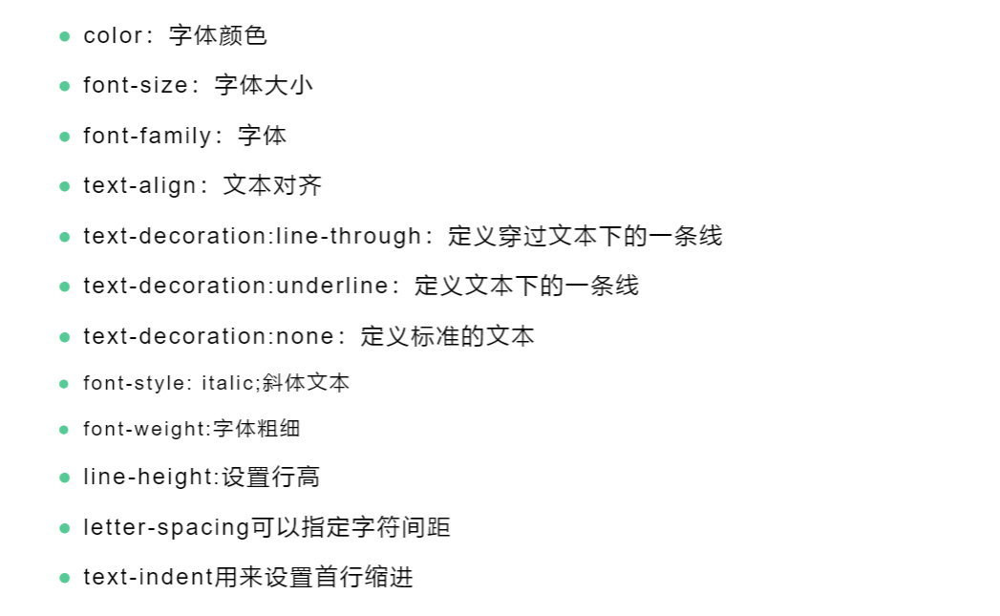
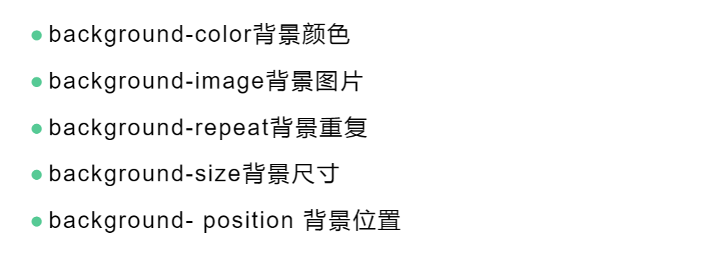

*修饰文本*：



*修饰背景*：



---

==透明度==：
由opacity属性定义，范围0.0-1.0（完全透明-完全不透明）
```html
		<style>
			#photo{
				opacity: 0.5; /*完全透明 0.0 ~~ 1.0 完全不透明*/
			}
		</style>
	<body>
		<!-- 原图 -->
		
		<!-- 设置半透明 -->
		
	</body>
```

==display==：
可以在块元素、行内元素、行内块元素间转化，block、inline、inline-block分别代表其值