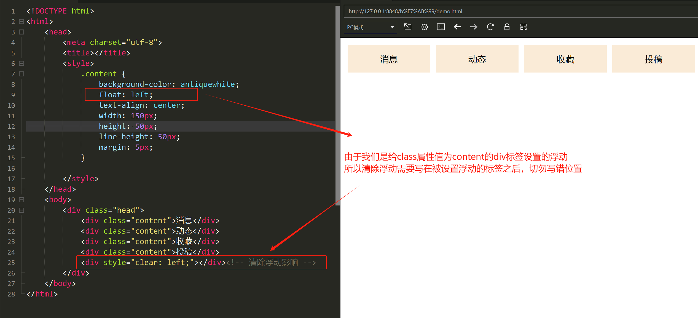

网页布局方式有：
- 标准流：按元素的书写方式依次排列
- 浮动
- 定位
- Flexbox、Grid自适应布局

由于网页默认是一个二维平面，当我们在网页中一行行摆放标签时，块标签会独占一行，行标签则只占自身大小，这种情况下要实现网页布局就很麻烦，所以我们就需要通过一些方法来改变这种默认的布局方式。

CSS中的浮动属性可以让==标签脱离原来的文档流==，创建浮动框将其移动到一边，直到左边缘或右边缘触及包含块或另一个浮动框的边缘，浮动后的标签默认是内容的大小，且可以为其设置宽和高。
浮动是==相对于父元素==浮动，只在内部移动

语法：
```html
<style>
选择器 {
	float: left/right/none;
}
</style>
```
特性：
- 脱标：脱离标准流
- 一行显示、顶部对齐
- 具备行内块元素特性

```html
<style>
       .father{
            border: 3px solid brown;
            background-color: aqua;
            overflow: hidden;
        }
        .left-son{
            width: 100px;
            height: 100px;
            background-color: yellowgreen;
            float: left;
        }
        .right-son{
            width: 100px;
            height: 100px;
            background-color: yellow;
            float: right;
        }
</style>
<body>
    <div class="father">
        <div class="left-son">左浮动</div>
        <div class="right-son">右浮动</div>
    </div>
        <p font="32px">这是后面的文字</p>
        <p font="32px">这是后面的文字</p>
</body>
```

但是浮动后的标签不占用原来文档流的空间，下面的标签就会向上移动，会影响后面的网页布局，所以我们通常==在浮动的标签后使用清除浮动属性==，自动让父级标签撑开



*两种清除浮动常用方法*：
- 浮动元素的父元素中添加属性：`overflow: hidden;`
- 添加父元素的伪元素选择器：
```html
<style>
.father::after {
content: "";
display: table;
clear: both;
}
</style>
```