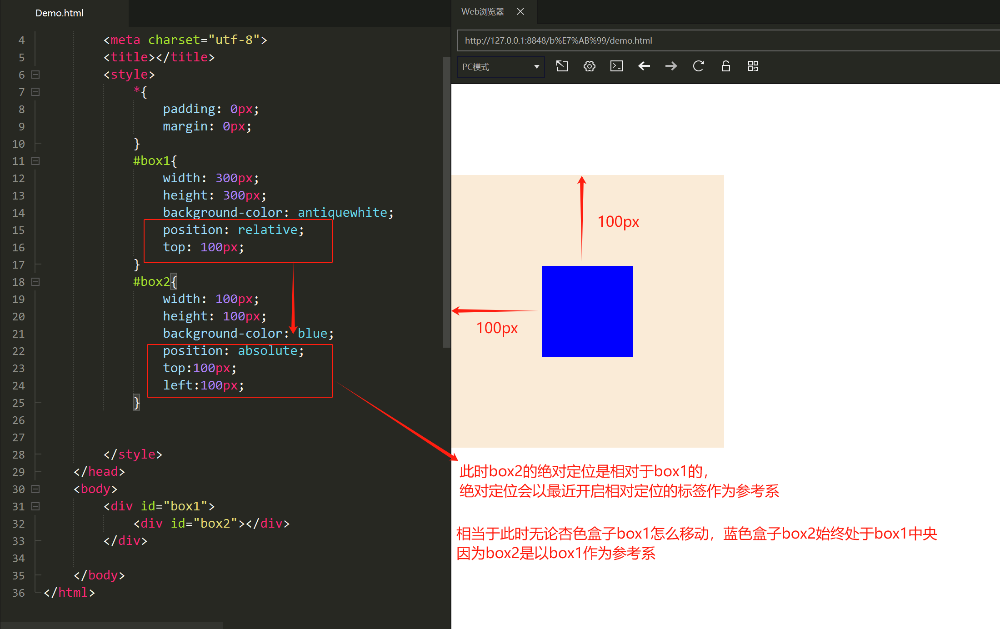

position 属性规定应用于元素的定位方法的类型（static 、relative、fixed、absolute 或 sticky）

- *position: static;*   （默认）
	HTML元素默认情况下的定位方式为 static（静态），静态定位的元素不受 top、bottom、left 和 right 属性的影响，不会以任何特殊方式定位，它始终根据页面的正常流进行定位。

- *固定定位    position: fixed;*
	固定定位的元素是==相对于视口定位的==，==不占据文档流==。即使滚动页面，它也始终位于同一位置。 top、right、bottom 和 left 属性用于定位此元素。

- *相对定位    position: relative;*       (相对定位和绝对定位是我们常用的 )
	==元素相对于其正常位置进行定位==。设置相对定位的元素的 top、right、bottom 和 left 属性将导致其偏离其正常位置进行调整。不会对其余内容进行调整来适应元素留下的任何空间。

- *绝对定位    position: absolute;*
	元素==相对于最近的定位祖先元素进行定位==（而不是相对于视口定位，如 fixed），==不占据文档流==。如果绝对定位的元素没有祖先，它将使用文档主体（body），并随页面滚动一起移动。

*属性*：top、right、left、bottom后接px表示距离这些方位的偏差
```html
<style>
       .box1 {
            height: 350px;
            background-color: aqua;
        }
        .box-normal {
            width:  100px;
            height: 100px;
            background-color: purple;
        }
        .box-relative {
            width:  100px;
            height: 100px;
            background-color: pink;
            position: relative;
            top: 40px;
            left: 120px;
        }
        .box2 {
            height: 350px;
            background-color: yellow;
            margin-bottom: 300px;
        }
        .box-absolute {
            width:  100px;
            height: 100px;
            background-color: yellowgreen;
            position: absolute;
            left: 120px;
        }
        .box-fixed {
            width:  100px;
            height: 100px;
            background-color: lightcoral;
            position: fixed;
            top: 300px;
            right: 0;
        }
</style>
<body>
    <h1>相对定位</h1>
    <div class="box1">
        <div class="box-normal"></div>
        <div class="box-relative"></div>
        <div class="box-normal"></div>
    </div>
    <h1>绝对定位</h1>
    <div class="box2">
        <div class="box-normal"></div>
        <div class="box-absolute"></div>
        <div class="box-normal"></div>
    </div>
    <div class="box-fixed">固定点位</div>
</body>
```

