> 课程网址：<https://learngitbranching.js.org/?locale=zh_CN>
> 项目开源：<https://github.com/pcottle/learnGitBranching>

本笔记基于 **Learn Git Branching**（PCottle 开源项目）中文版课程内容整理。所有关卡的题目、目标、参考命令与图示均按"介绍 → 分支 → 合并 → 变基 → 相对引用 → 撤销 → 整理提交 → 本地/远程 → 远程协作 → 高级"由浅入深组织。

阅读建议：

1. **边读边练**：把网页和笔记并行打开，每读完一节立即到网站上实际操作。
2. **不要背命令，理解图**：Git 本质是"指向快照的有向无环图"，命令都只是改变引用（branch / HEAD）和新增提交。
3. **关卡 "show solution" 只是参考**：推荐先尝试，再对比解法与图示。

---

## 0. 课程结构总览

| 大章节 | 中文名称 | 核心命令 | 重点能力 |
| --- | --- | --- | --- |
| 1 | 介绍序列（Introduction Sequence） | `git commit` | 理解 commit 对象 |
| 2 | 渐入佳境（Ramping Up） | `git branch`, `git checkout` | 创建/切换分支 |
| 3 | 分支与合并（Branching & Merging） | `git merge`, `git rebase` | 合并分支 |
| 4 | 相对引用（Relative Refs） | `HEAD^`, `HEAD~` | 链式引用 |
| 5 | 撤销变更（Reversing Changes） | `git reset`, `git revert` | 安全回滚 |
| 6 | 移动提交（Moving Work Around） | `cherry-pick`, `rebase -i` | 整理提交 |
| 7 | 远程入门（Remote Intro） | `git clone` | 本地/远端模型 |
| 8 | 远程进阶（Push & Pull） | `git push`, `git pull` | 推送与同步 |
| 9 | 远程高级（Remote Advanced） | `git fetch`, `rebase` 远端 | 团队协作 |
| 10 | 高级主题（Advanced Topics） | `reflog` | 找回丢失提交 |

所有 Git 树状图采用 Mermaid `gitGraph` 语法绘制。例如：

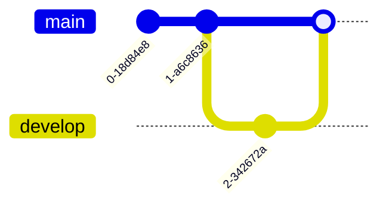

---

## 1. 介绍序列（Introduction Sequence）

这一章节让你熟悉 Git 仓库的基本模型：提交快照 + 指针。

### 关卡 1.1　Git Commit

**任务**：创建一个名为 `C2` 的新提交。

**新学命令**：`git commit`

**解法**：

```bash
git commit
```

**初始图示**：

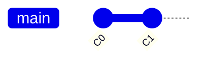

**完成后图示**：

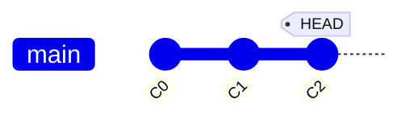

---


## 2. 渐入佳境（Ramping Up）

掌握 `git branch` 和 `git checkout`，理解分支是"指向某个提交的指针"。

### 关卡 2.1　用多种方法创建分支

**任务**：分别用 `git branch`+`checkout`、`git checkout -b` 两种方式创建 `bugFix` 分支，并切换到 `bugFix` 上提交两次。

**新学命令**：`git branch`、`git checkout`、`git checkout -b`

**解法**：

```bash
git branch bugFix       # 创建但不切换
git checkout bugFix     # 切换过去
git commit              # C2
git commit              # C3
```

或一次性：

```bash
git checkout -b bugFix  # 创建并切换
git commit
git commit
```

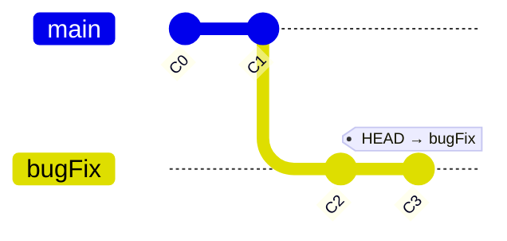

---

### 关卡 2.2　合并（Branch and Merge）

**任务**：在 `bugFix` 分支提交一次后切回 `main`，再把 `bugFix` 合并回 `main`。

**新学命令**：`git merge <branch>`

**解法**：

```bash
git checkout -b bugFix
git commit
git checkout main
git merge bugFix
```

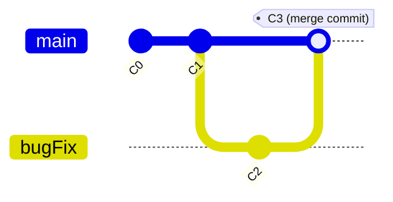

> 💡 `main` 与 `bugFix` 处于同一提交，所以此次合并不产生新的"合并提交"，只是把 `main` 指针快进到 `bugFix`。这叫 **Fast-Forward**。

---

### 关卡 2.3　多分支合并（Merge with multiple branches）

**任务**：创建 `bugFix` 提交、创建 `feature` 提交，然后把两个都合并回 `main`。

**解法**：

```bash
git checkout -b bugFix; git commit
git checkout main
git checkout -b feature; git commit
git checkout main
git merge bugFix
git merge feature
```

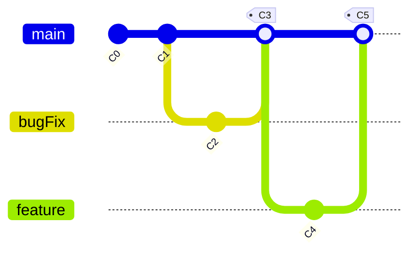

---


## 3. Rebase 简介（Rebase Introduction）

Rebase 把当前分支的提交"摘下来"，在另一个分支顶端重放，使历史呈线性。

### 关卡 3.1　Rebase 基础

**任务**：在 `bugFix` 上提交两次，然后把 `bugFix` rebase 到 `main` 顶端。

**新学命令**：`git rebase <branch>`

**解法**：

```bash
git checkout -b bugFix; git commit; git commit
git checkout main; git commit
git checkout bugFix
git rebase main
```

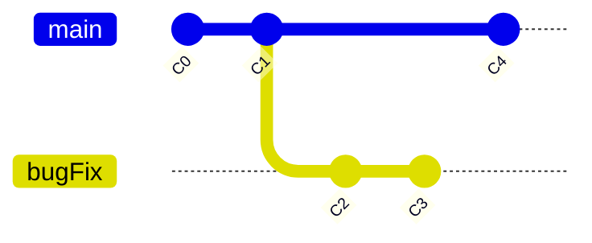

**Rebase 后**：

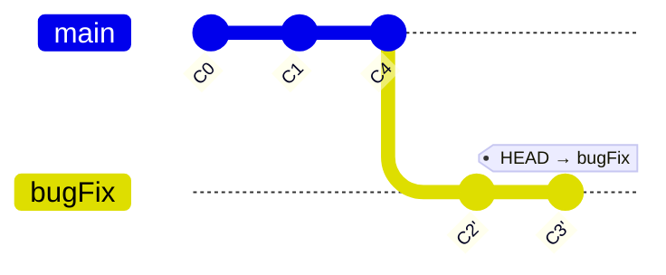

> ⚠️ Rebase 改写了提交哈希（因为父节点变了），等价于"复制并重新提交"。**永远不要对已经推送到公共分支的提交做 rebase**。

---


## 4. 相对引用（Relative Refs）

使用 `HEAD^`、`HEAD~`、`HEAD~<n>` 这种链式语法，比记忆哈希值方便得多。

### 关卡 4.1　`^` 与 `~`

**任务**：将 `HEAD` 向上移动 1、2、3 步，使用 `^` 和 `~` 验证。

**新学命令**：`HEAD^`、`HEAD~`

**解法**：

```bash
git checkout HEAD^
git checkout HEAD^^
git checkout HEAD~3
```

**图示（HEAD 上移 3 步）**：

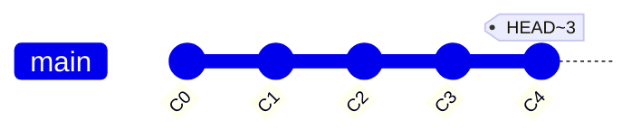

---

### 关卡 4.2　强制分支指向（`-f`）

**任务**：将 `main` 强制指向 `HEAD~2` 处；将 `bugFix` 强制指向 `HEAD~1` 处。

**新学命令**：`git branch -f <branch> <target>`

**解法**：

```bash
git branch -f main HEAD~2
git branch -f bugFix HEAD~1
```


> 📌 `-f` 等价于：把某个分支强制重新指向指定提交。配合相对引用使用特别强大。

---


## 5. 撤销变更（Reversing Changes）

Git 提供两种撤销机制：本地未推送用 `reset`；已推送用 `revert`（生成反向提交）。

### 关卡 5.1　Reset 与 Revert

**任务**：把 `local` 撤销两次（用 `reset`），把 `pushed` 撤销两次（用 `revert`）。

**新学命令**：`git reset`、`git revert`

**解法**：

```bash
git reset HEAD~1     # 在 local 分支
git revert HEAD      # 在 pushed 分支
git reset HEAD~1
git revert HEAD
```

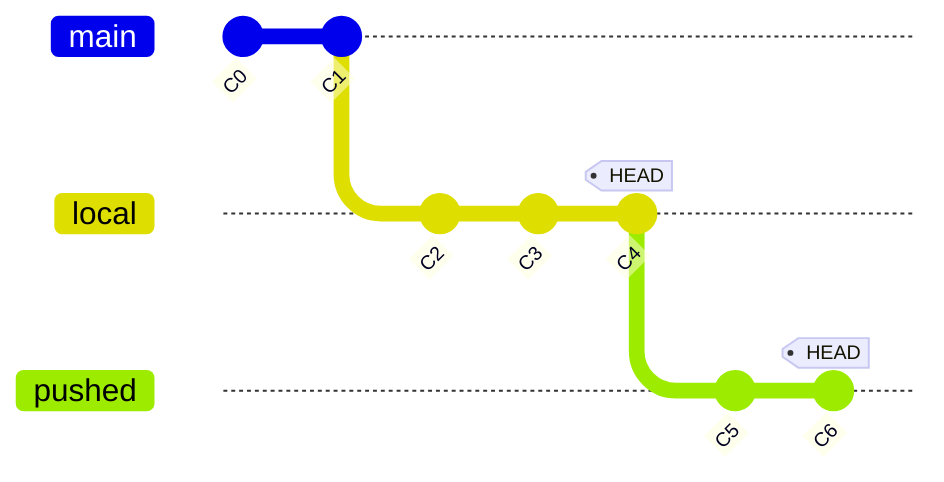

**结果**：

- `local` 通过 `reset` 把指针回退到 `C2`，`C3/C4` 变成"悬挂提交"（reflog 仍能找回）。
- `pushed` 通过 `revert` 生成 `C5'` 反向提交 + `C6'` 反向提交，历史保持线性增长。

---


## 6. 移动提交（Moving Work Around）

把已有的提交"挑出来"复制或重排，用于把零散的提交整理成清晰的故事线。

### 关卡 6.1　Cherry-pick 入门

**任务**：把 `side` 上的 `C2`、`C3` 两个提交，依次 cherry-pick 到 `main`。

**新学命令**：`git cherry-pick <commit1> <commit2> ...`

**解法**：

```bash
git checkout main
git cherry-pick C2 C3
```

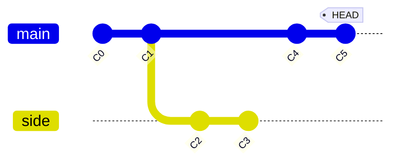

**Cherry-pick 后**：

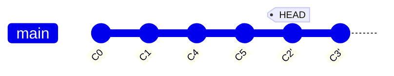

> 💡 `cherry-pick` 会把指定提交**原封不动**地复制过来，因此提交内容、作者、消息都保持，但哈希会变。

---

### 关卡 6.2　交互式 Rebase 入门

**任务**：把 `main` 上多余的两个提交合并成一个。

**新学命令**：`git rebase -i HEAD~<n>`

**解法**：

```bash
git rebase -i HEAD~2     # 弹出编辑器，把第二个 pick 改为 squash
```

**交互窗口示意（编辑器中）**：

```
pick c2  bug fix feature
pick c3  typo
# 把第二行改为：
squash c3  typo
```

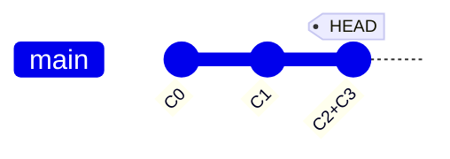

> 📌 `rebase -i` 是整理本地提交历史最常用的工具：可改顺序（reorder）、合并（squash）、重命名（reword）、删除（drop）。

---


## 7. 本地与远程分支（Local & Remote）

Git 用 `remote/<branch>` 表示只读的远端镜像，用 `<branch>` 表示你自己的本地视图。

### 关卡 7.1　本地提交 vs 远程同步

**任务**：完成 5 个 commit 与 2 个 push 操作。

**新学命令**：`git commit`、`git push`

**解法**：

```bash
git commit; git commit; git commit; git commit; git commit
git push origin main
git push
```

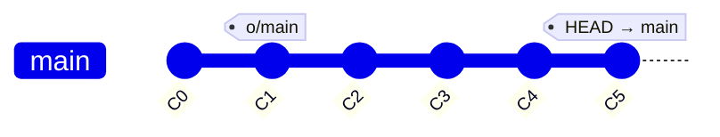

---


## 8. 推送与拉取（Push & Pull）

`git fetch` 把远端拉到本地只读视图；`git merge`/`rebase` 再合并到本地分支；`git push` 把本地推回远端。

### 关卡 8.1　`git fetch` + 合并

**任务**：把 `main` 同步成远端的样子。

**解法**：

```bash
git fetch
git merge o/main
```

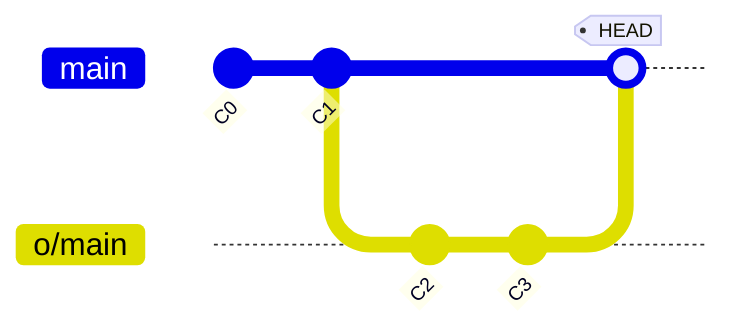

**或者一行**：

```bash
git pull        # 等价于 fetch + merge
```

---

### 关卡 8.2　`git pull --rebase`

**任务**：用 rebase 而不是 merge 同步远端。

**新学命令**：`git pull --rebase`

**解法**：

```bash
git fetch
git rebase o/main
```

或一行：

```bash
git pull --rebase
```

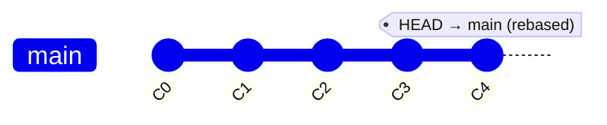

---

### 关卡 8.3　远程分支落后时推送

**任务**：把本地 `main` 推送到远端前，先 fetch 并合并远端的改动。

**解法**：

```bash
git fetch
git rebase o/main
git push
```


---


## 9. 远程高级（Remote Advanced）

真实工作中，你往往要同时跟踪多个远端分支、跨分支挑拣提交。

### 关卡 9.1　跟踪任意分支

**任务**：把远端 `o/main` 的最新提交 cherry-pick 到本地 `main`，并 push 回去。

**解法**：

```bash
git fetch
git cherry-pick o/main
git push
```

### 关卡 9.2　`git push` 指定源

**任务**：把本地 `foo` 分支推送到远端的 `bar` 上。

**解法**：

```bash
git push origin foo:bar
```

### 关卡 9.3　`git fetch` 指定源

**任务**：把远端的 `bar` 取回到本地 `foo`。

**解法**：

```bash
git fetch origin bar:foo
```

### 关卡 9.4　没有 source 时的特殊语法

**任务**：删除远端 `bar`、创建本地 `foo` 跟踪远端 `main`、把本地 `foo` 推上去。

**解法**：

```bash
git push origin :bar       # 删除远端 bar
git fetch origin main:foo  # 拉取并创建 foo
git checkout foo           # 切到 foo 跟踪 main
```

### 关卡 9.5　拉取所有远端

**任务**：一次取回所有远端更新。

**解法**：

```bash
git fetch --all
git branch -r                  # 查看所有远程分支
```

---


## 10. Push & Pull 的进阶参数

实战中你需要对"要拉/推哪些引用"做精细控制。

### 关卡 10.1　`git push` 的 `<source>:<destination>`

**任务**：把本地 `main` 推送到远端 `foo`。

**解法**：

```bash
git push origin main:foo
```

### 关卡 10.2　`git fetch` 的 `<source>:<destination>`

**任务**：把远端 `main` 取回到本地 `foo`。

**解法**：

```bash
git fetch origin main:foo
```

### 关卡 10.3　空 source = 删除

**任务**：删除远端 `foo`。

**解法**：

```bash
git push origin :foo
```

### 关卡 10.4　`git pull --rebase` 的实战

**任务**：团队成员在你之前推送了 `o/main`，你需要在自己的 `C2/C3` 基础上 rebase 到远端最新。

**解法**：

```bash
git fetch
git rebase o/main
git push
```

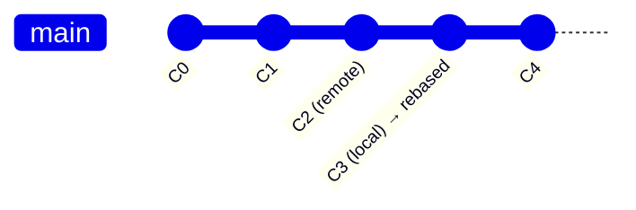

---


## 11. 模拟团队协作（Detached HEAD & Reflog）

最后一关是综合演练：多人协作下分支被打散，如何用 `reflog` 把历史找回。

### 关卡 11.1　Detached HEAD 与回退

**任务**：把 `bugFix` 移动到 `main` 之前，回到 `main` 状态后，用 `reflog` 找回 `bugFix` 上的提交。

**解法**：

```bash
git checkout C4        # 进入 detached HEAD 状态
git checkout main      # 回来后提交变成悬挂
git reflog             # 找到悬挂提交的哈希
git checkout HEAD@{1}  # 回到那次提交
git branch bugFix      # 重新挂到 bugFix 上
```

**图示（reflog 找回）**：

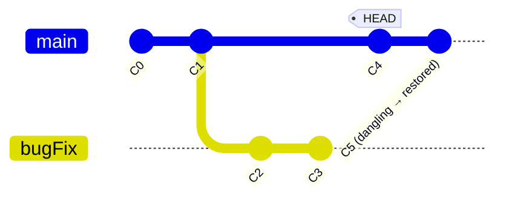

> 🔑 `reflog` 记录了 HEAD 的所有变更历史，即使 reset 后仍然可以找回"丢失"的提交。

---


## 12. 命令速查表

### 12.1　基础 / 本地

| 命令 | 作用 | 示例 |
| --- | --- | --- |
| `git commit` | 在当前 HEAD 上新增提交 | `git commit -m "feat: login"` |
| `git branch <name>` | 创建分支 | `git branch feature` |
| `git checkout <name>` | 切换分支 | `git checkout feature` |
| `git checkout -b <name>` | 创建并切换 | `git checkout -b feature` |
| `git branch -f <name> <target>` | 强制分支指向 | `git branch -f main HEAD~2` |
| `git merge <branch>` | 合并到当前分支 | `git merge bugFix` |
| `git rebase <branch>` | 变基到目标分支 | `git rebase main` |
| `git rebase -i HEAD~n` | 交互式变基 | `git rebase -i HEAD~3` |
| `git cherry-pick <c1> <c2>` | 挑选提交 | `git cherry-pick C2 C3` |
| `git reset HEAD~1` | 回退本地指针 | `git reset --hard HEAD~1` |
| `git revert HEAD` | 生成反向提交 | `git revert <commit>` |
| `git reflog` | 查看 HEAD 历史 | `git reflog` |

### 12.2　远程

| 命令 | 作用 | 示例 |
| --- | --- | --- |
| `git clone <url>` | 克隆仓库 | `git clone https://github.com/.../repo.git` |
| `git fetch` | 拉取远端到 `o/*` | `git fetch origin` |
| `git fetch --all` | 拉取所有远端 | `git fetch --all` |
| `git pull` | `fetch + merge` | `git pull` |
| `git pull --rebase` | `fetch + rebase` | `git pull --rebase` |
| `git push` | 推送当前分支 | `git push` |
| `git push -f` | 强制推送 | `git push -f origin main` |
| `git push origin src:dst` | 自定义推送 | `git push origin foo:bar` |
| `git push origin :dst` | 删除远端 | `git push origin :foo` |
| `git fetch origin src:dst` | 自定义拉取 | `git fetch origin main:foo` |

### 12.3　相对引用

| 符号 | 含义 | 例子 |
| --- | --- | --- |
| `HEAD^` | 上一个父提交 | `HEAD^` = `HEAD~1` |
| `HEAD~n` | 上 n 个父提交 | `HEAD~3` |
| `HEAD^^^` | 上 3 个父提交 | 等价 `HEAD~3` |
| `<branch>~n` | 引用分支链 | `main~2` |

### 12.4　交互式 Rebase 指令

| 指令 | 作用 |
| --- | --- |
| `pick` | 保留该提交 |
| `reword` | 改消息 |
| `edit` | 暂停以便修改 |
| `squash` | 与前一个合并 |
| `fixup` | 与前一个合并（丢弃消息） |
| `drop` | 删除该提交 |

---


## 13. 学习路线建议

1. **先动手，再看图**：把 12 个主要关卡都通一遍，每关截图存档（网页自带 `show solution` 按钮旁边的 Git 树）。
2. **把命令"翻译"成图**：每个 `cherry-pick`、`rebase`、`reset` 都对应一种图的变化，先在纸上手绘，再做命令。
3. **本地搭一个小 demo**：`git init` 一个空仓库，按教程顺序敲一遍命令，每步都用 `git log --oneline --graph --all` 验证图形。
4. **造一个真实场景**：在 GitHub 上开一个私有仓库，模拟"master → feature → rebase → push --force-with-lease" 的全过程。
5. **进入 Pro Git**：<https://git-scm.com/book/zh/v2> 深入 `git internals`、`reflog`、`bisect`、`worktree` 等高级主题。

---

## 附录 A：英文 / 中文术语对照

| 英文 | 中文 | 说明 |
| --- | --- | --- |
| commit | 提交 / 快照 | Git 仓库中的基本单位 |
| branch | 分支 | 指向某个提交的可移动指针 |
| merge | 合并 | 把两个分支历史合到一起 |
| rebase | 变基 | 把当前分支的提交"摘下"放到另一分支顶端 |
| HEAD | 当前引用 | 指向当前所在分支或提交 |
| detached HEAD | 分离头指针 | HEAD 直接指向某个提交而非分支 |
| fast-forward | 快进 | 不产生新提交，仅移动指针的合并 |
| remote tracking branch | 远程跟踪分支 | `origin/main` 这种 `o/*` 形式的只读分支 |
| cherry-pick | 拣选 | 把指定提交复制到当前分支 |
| reflog | 引用日志 | 记录 HEAD 与分支所有变更的日志 |

---