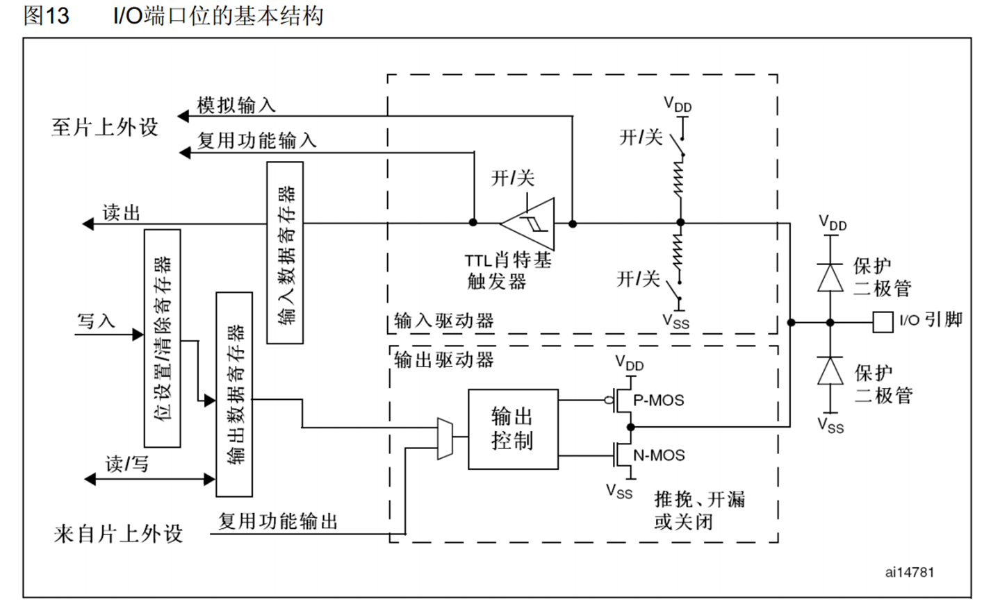
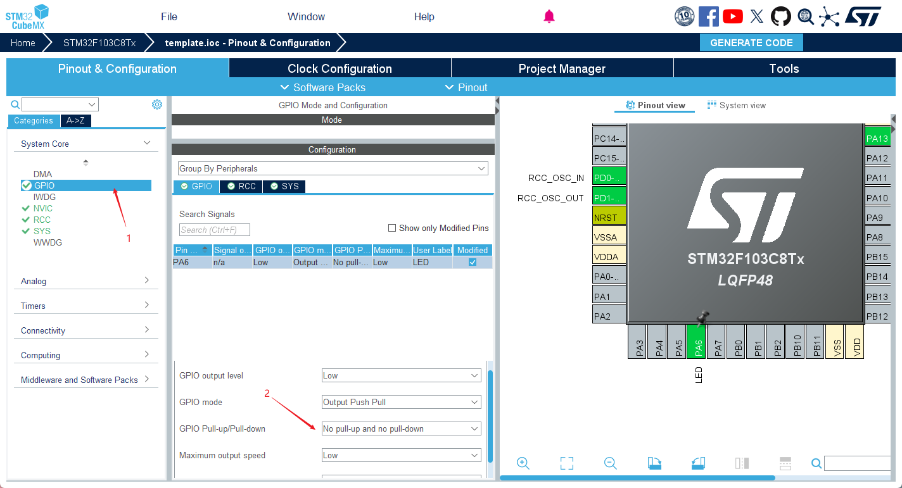
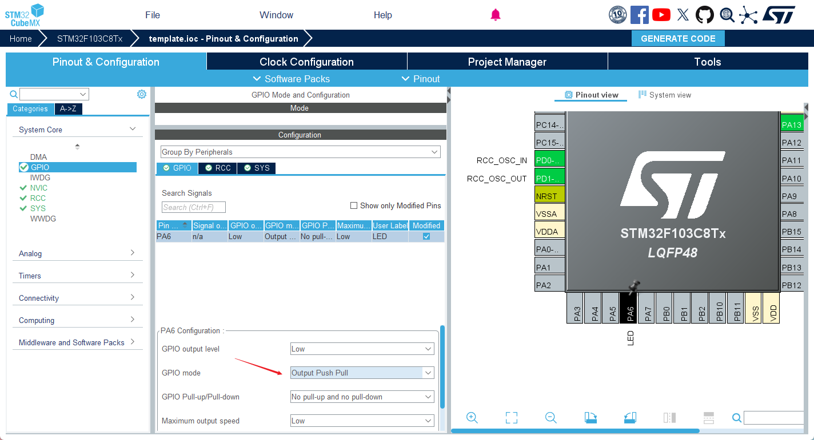
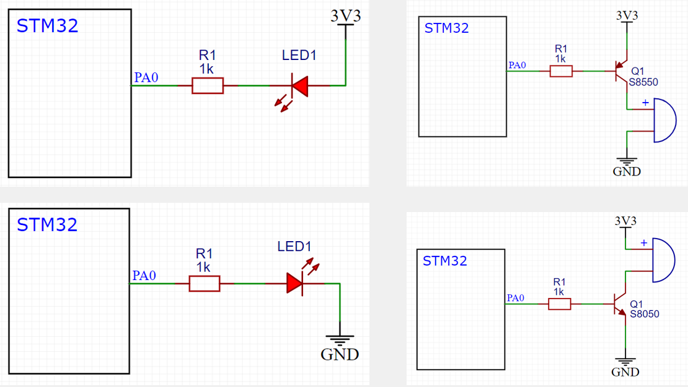
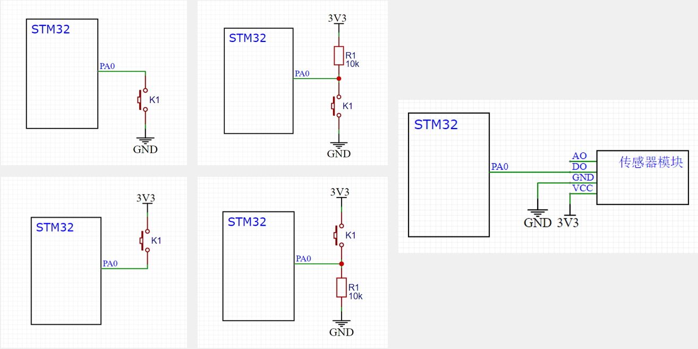

> GPIO 即 General Purpose Input Output 通用输入输出口，可配置为 8 种输入输出模式，引脚电平为 *0-3.3V*，部分引脚可容忍 5V(被标记为 FT)
	输出模式下可控制端口输出高低电平用于驱动 LED、控制蜂鸣器、模拟通信协议输出时序等
	输入模式下可读取端口的高低电平或电压，用于读取按键输入、外接模块电平信号输入、ADC 电压采集、模拟通信协议接收数据等

### GPIO 位结构


> 图中左边为寄存器,中间为驱动器,右边为 IO 口引脚

右上角对应 GPIO Pull-up/Pull-down，如果
1. 上拉电阻导通就为上拉输入模式 Pull-up *默认输入高电平*，
2. 下拉电阻导通就为下拉输入模式 Pull-down *默认输入低电平*，
3. 都不导通为浮空输入模式，*输入电平受外界影响不稳定*



右下角对应 GPIO mode，如果
1. 选择 Push Pull，则 P-MOS、N-MOS 均有效，高低电平均有驱动能力
2. 选择 Open Drain，则只有 N-MOS 有效，只有低电平有驱动能力，需要外部电路给予高电平驱动能力

Open Drain 可作为通信协议的驱动方式如 I2C 通信引脚，在多机通信情况下可避免各个设备的相互干扰；还可利用外部电路使 IO 口输出 5V 的高电平



### 8 种工作模式

|模式名称|性质|特征|
|--|--|--|
|浮空输入|数字输入|可读取引脚电平，若引脚悬空，则电平不确定|
|上拉输入|数字输入|可读取引脚电平，内部连接上拉电阻，悬空时默认高电平|
|下拉输入|数字输入|可读取引脚电平，内部连接下拉电阻，悬空时默认低电平|
|模拟输入|模拟输入|GPIO无效，引脚直接接入内部ADC|
|开漏输出|数字输出|可输出引脚电平，高电平为高阻态，低电平接VSS|
|推挽输出|数字输出|可输出引脚电平，高电平接VDD，低电平接VSS|
|复用开漏输出|数字输出|由片上外设控制，高电平为高阻态，低电平接VSS|
|复用推挽输出|数字输出|由片上外设控制，高电平接VDD，低电平接VSS|

### 硬件电路



- 左上图为*低电平控制 LED 发光的原理*：低电平导致电流正向导通而发光，高电平没有电压差而熄灭（限流电阻防止电流过大烧坏 LED）
- 左下图为高电平控制 LED 发光的原理
- 右上图为 PNP 三极管驱动电路，低电平导通
- 右下图为 NPN 三极管驱动电路，高电平导通

> [!INFO]
> 单片机中多用第一种，因为大多数单片机采用高电平弱驱动、低电平强驱动的规则，此时弱驱动不适合用左下图的方式



左侧为按键控制 GPIO 输入的原理
- 左上角为最常用接法，要求 IO 口为 **Pull-up 模式**
- 左下角要求 IO 口为 Pull-down 模式
- 右边两图外置上/下拉电阻，IO 口浮空输入即可

> [!INFO]
> 单片机一般使用上面两种接法

### 使用 GPIO 步骤

1. 使用 RCC 开启 GPIO 的时钟
2. 使用 GPIO_Init 函数初始化 GPIO
3. 使用输出或输入函数控制 GPIO

相关库函数：
1. RCC 外设库函数：
	RCC_AHB 外设时钟控制、RCC_APB2 外设时钟控制、RCC_APB1 外设时钟控制
	作用：*使能或失能外设时钟*

```c
/* 标准库stm32f10x
 * 参1为外设名，参2为ENABLE或DISABLE
 */
void RCC_AHBPeriphClockCmd(uint32_t RCC_AHBPeriph,FunctionalState 	NewState)
void RCC_APB2PeriphClockCmd(uint32_t
	RCC_APB2Periph,FunctionalState NewState)
void RCC_APB1PeriphClockCmd(uint32_t
	RCC_APB1Periph,FunctionalState NewState)

/* HAL库stm32f1xx
 * 使用宏，相比标准库可拓展性更好
 */
_HAL_RCC_<外设名>_CLK_ENABLE(); // 使能
_HAL_RCC_<外设名>_CLK_DISABLE(); // 失能
```

> [!INFO]
> 使用库函数，最好通过库查询了解

2. GPIO 库函数：
	==初始化：==
	- `void GPIO_DeInit(GPIO_TypeDef* GPIOx)`，参数可选 **GPIOA、GPIOB** 等，使指定的 GPIO 外设复位
	- `void GPIO_AFIODeInit(void)`，复位 AFIO 外设
	- `void GPIO_Init(GPIO_TypeDef* GPIOx,GPIO_InitTypeDef* GPIO_InitStruct)`，需要定义一个结构体变量，再给结构体赋值，最后调用这个函数，用结构体的参数初始化 GPIO 口
	- `void GPIO_StructInit(GPIO_InitTypeDef* GPIO_InitStruct)`，把结构体变量赋默认值
	==读取：==
	- `uint8_t GPIO_ReadInputDataBit(GPIO_InitTypeDef* GPIOx,uint16_t GPIO_Pin)`，读取输入数据寄存器某端口输入值
	- `uint16_t GPIO_ReadInputData(GPIO_InitTypeDef* GPIOx)`，读取整个输入数据寄存器的值，每一位代表一个端口
	- `uint8_t GPIO_ReadOutputDataBit(GPIO_InitTypeDef* GPIOx,uint16_t GPIO_Pin)`
	- `uint16_t GPIO_ReadOutputData(GPIO_InitTypeDef* GPIOx)`
	==写入：==
	- `void GPIO_SetBits(GPIO_TypeDef* GPIOx,uint16_t GPIO_Pin)`，把指定端口设置为高电平
	- `void GPIO_ResetBits(GPIO_TypeDef* GPIOx,uint16_t GPIO_Pin)`，把指定端口设置为低电平
	- `void GPIO_WriteBit(GPIO_TypeDef* GPIOx,uint16_t GPIO_Pin,BitAction BitVal)`，根据 BitVal 的值设置指定端口，可取值 **Bit_RESET、Bit_SET** 分别为置低电平、置高电平
	- `void GPIO_Write(GPIO_TypeDef* GPIOx,uint16_t PortVal)`，可以同时对 16 个端口进行写入操作


