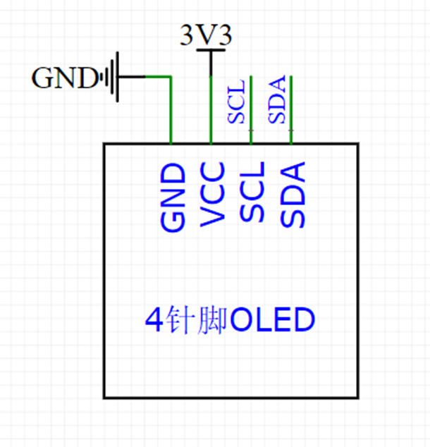
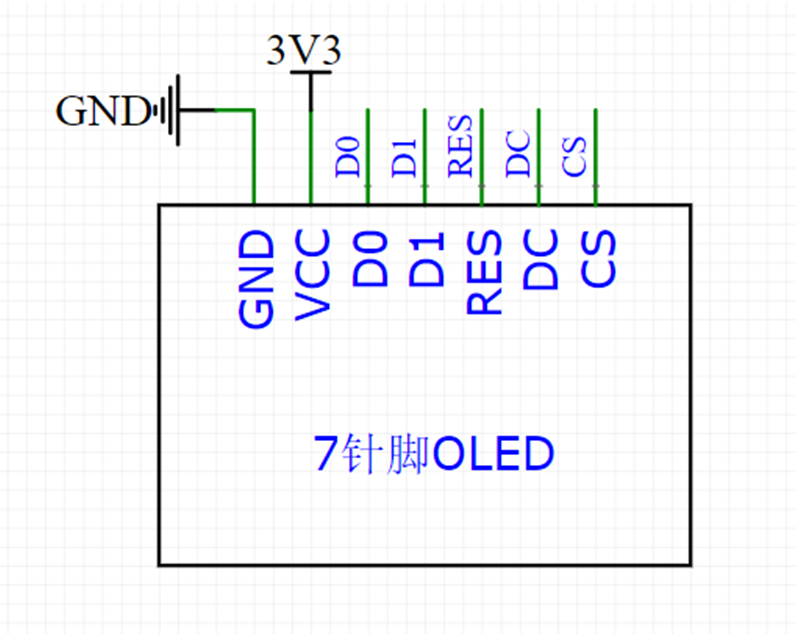
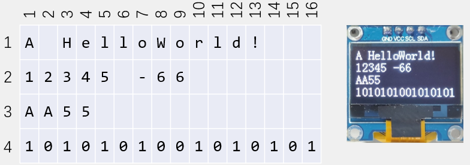

OLED 显示屏参数：
	- 供电：3-5.5V
	- 通信协议：I2C/SPI
	- 分辨率：128x64

> I2C 对应 4 引脚，SPI 对应 7 引脚

### 硬件电路

I2C 协议电路：

SPI 协议电路：

### OLED 配置

包含头文件、源文件、字体文件，直接复制到 Hardware 中使用

### OLED 函数

| 函数                              | 作用                 |
| --------------------------------- | -------------------- |
| OLED_Init()                       | 初始化               |
| OLED_Clear()                      | 清屏                 |
| OLED_ShowChar(1,1,'A')            | 显示一个字符         |
| OLED_ShowString(1,3,"Helloworld") | 显示字符串           |
| OLED_ShowNum(2,1,12345,5)         | 显示十进制数字       |
| OLED_ShowSignedNum(2,7,-66,2)     | 显示有符号十进制数字 |
| OLED_ShowHexNum(3,1,0xAA55,4)     | 显示 16 进制数字     |
| OLED_ShowBinNum(4,1,0xAA55,16)    | 显示 2 进制数字      |

上面函数作用显示：
