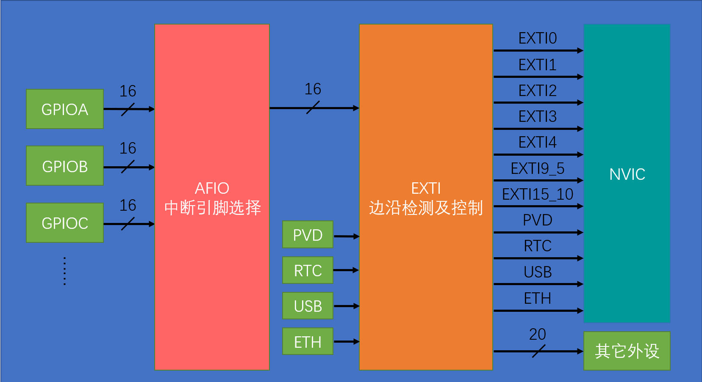

*中断*：
	主程序运行时出现特定的中断触发条件，使得 CPU 暂停当前任务去处理中断程序，处理完成后又返回原来被暂停的位置继续运行

### Extern Interrupt

EXTI 可以监测指定 GPIO 口的电平，当其变化时，立刻向 NVIC（嵌套中断向量控制器） 发出中断申请，经过裁决后即可中断 CPU 主程序去执行对应的中断程序

**触发方式：** 上升沿、下降沿、双边沿、软件触发

> 支持任意 GPIO 口，但相同的 Pin 不能同时触发中断（因为 AFIO 只能选择一个），如 PA0 与 PB0

**通道：** 16 个 GPIO_Pin 对应 GPIO_Pin_0 到 GPIO_Pin_15，外加 PVD 输出、RTC 时钟、USB 唤醒、以太网唤醒

### NVIC 优先级分组

中断优先级由优先级寄存器的 4 位决定，分为高 n 位的抢占优先级和低 4-n 位的响应优先级

> 抢占优先级高可以中断嵌套、响应优先级高可以优先排队，均相同的按中断号排队

| 分组方式 | 抢占优先级    | 响应优先级    |
| ---- | -------- | -------- |
| 分组 0 | 0 位，0    | 4 位，0-15 |
| 分组 1 | 1 位，0-1  | 3 位，0-7  |
| 分组 2 | 2 位，0-3  | 2 位，0-3  |
| 分组 3 | 3 位，0-7  | 1 位，0-1  |
| 分组 4 | 4 位，0-15 | 0 位，0    |
