以 stm32f103c8t6 为例说明，依赖插件：STM32CubeIDE for Visual Studio Code

## HAL 库开发流程

具体方案是用 STM32CubeMX 建立工作区，然后使用 vscode 编辑代码、烧录程序

### STM32CubeMX

新建工作区：
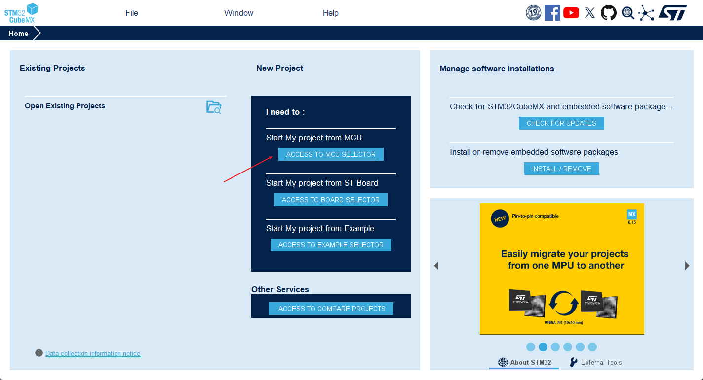

在此页面中选择芯片，然后 Start Project：
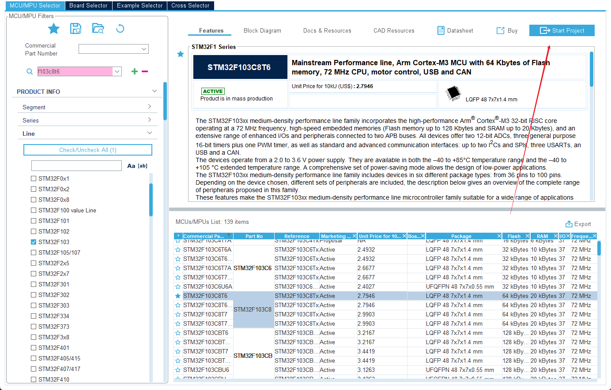

进入界面，按箭头标识的顺序选择*调试的方式*，然后可以在 Pinout view 界面对芯片各种引脚进行配置（以 PA6 配置 LED 为例）
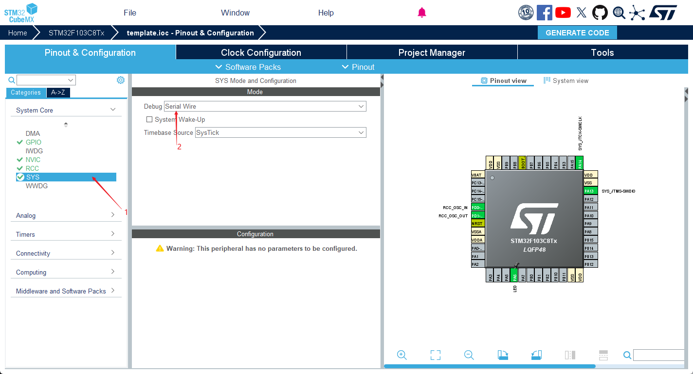

进入 RCC，配置外部时钟
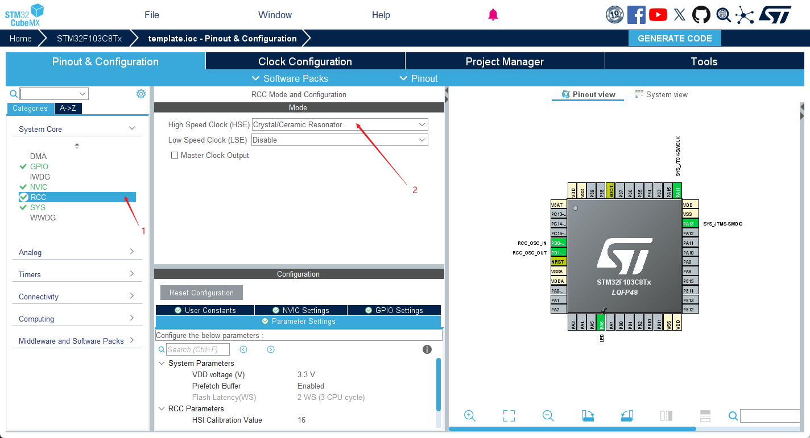

配置完时钟后，在 Clock Configuration 配置时钟数，*选择 HSE 和 PLLCLK*
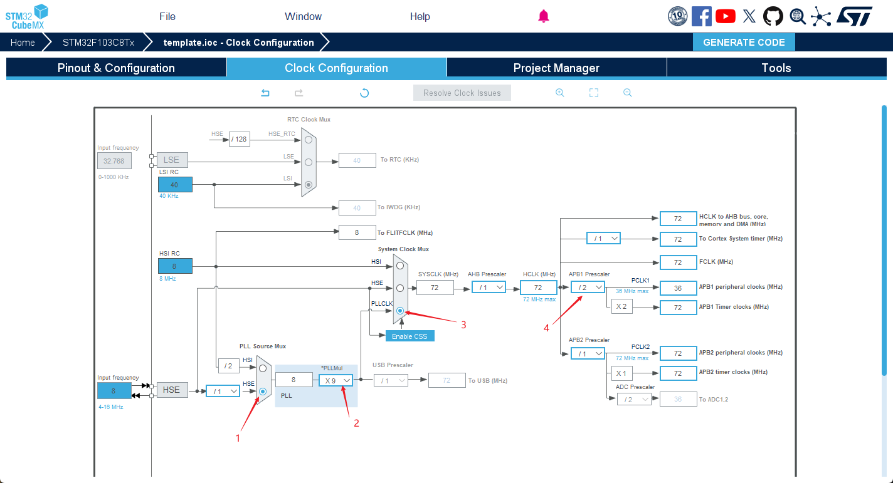

进入 Project Manager 界面，进行必要的设置，最后点击右上角生成代码
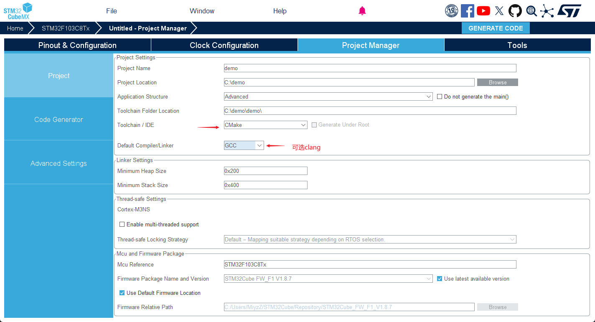
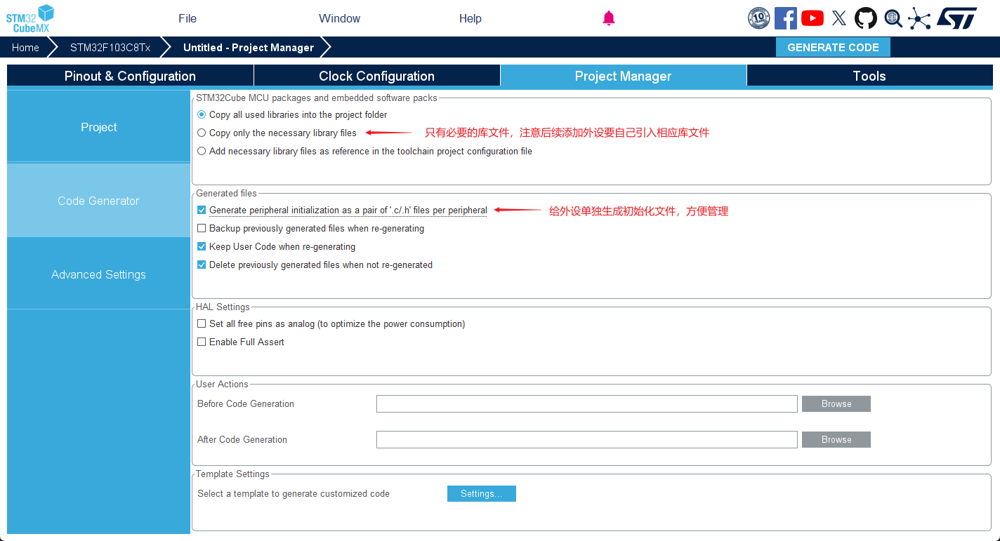
### Vscode

用 Vscode 打开上面工作区，*命令栏中Cmake* 首先会识别，开发过程中选择 Debug 预设即可配置 Cmake 工具链；随后*右下角弹出 STM32 插件识别*的消息，点击接受即可安装需要的工具链，保存在用户目录下AppData\Local\stm32cube\bundles

如果缺失一些工具链，可以如图在右图中勾选安装
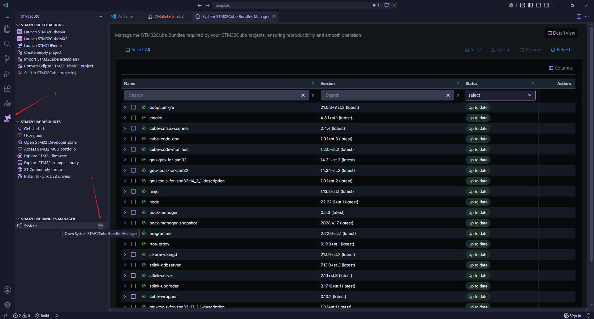

工作区分区如：
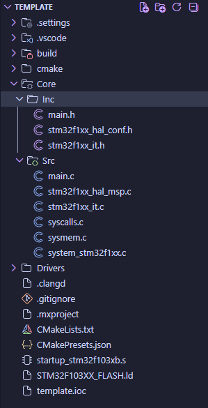
> - .settings 文件夹记录要使用的工具链及版本和工程的芯片信息
> - .vscode 文件夹记录了一些插件需要的配置
> - Core 文件夹包含工作区的核心，源文件在 Src 中，头文件在 Inc 中，可以自己修改按功能分区管理
> - Drivers 中有 STM32F1xx_HAL_Driver 标准驱动，含有库函数

**烧录**时插好板子，在 Run and Debug -> STM32CUBE DEVICES AND BOARDS 可看到已连接的下载器
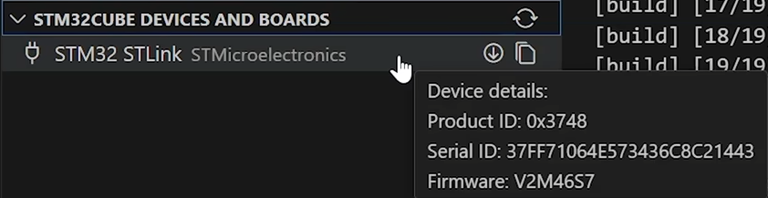
如果固件老旧，可点击 download 图标进行固件升级，**升级前后都要插拔一次下载器**

点击 Run and Debug，在命令栏选择相应的下载器，即可将程序下载到芯片中，同时调试开始停在主函数


---

## 标准库开发流程

具体方案是下载 [ST官网](https://www.st.com.cn/zh/embedded-software/stsw-stm32054.html)的标准库或直接用江协的源码示例，然后再 vscode 生成工程

### 新建工程

从 stm32 插件入口选择新建空白工程，在命令栏选择 Device(5030 available)，选择相应的芯片与项目位置，在弹出项目中选择 debug 模式
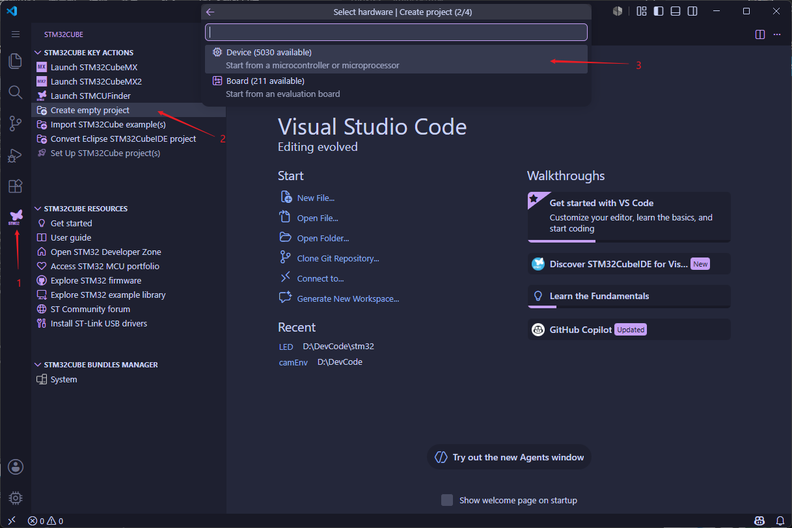

### 添加 Hardware、Library、Start、System

以江协的 STM32 示例工程为例，先**将 User/stm32f10x_conf.h 添加到 Start 文件夹中**，然后将 Hardware、Library、Start、System 文件夹复制到项目文件夹中

### 修改 CMakeLists

详见[stm32CMake样例详解](../Language/CMake/stm32CMake样例详解.md)

将下面代码覆盖项目根目录顶部 CMakeLists 中 92 行
```cmake
# Add sources to executable
file(GLOB_RECURSE SPL_SOURCE
    Library/*.c
    Hardware/*.c
    System/*.c
)
# Add to project build list
list(APPEND SOURCES ${SPL_SOURCE})

target_sources(${CMAKE_PROJECT_NAME} PUBLIC ${sources_SRCS} ${SPL_SOURCE})
```

完成后，在 107 行后引入头文件
```cmake
# add include paths
	Library
	Start
	Hardware
	System
```

接着在 123 行后引入
```cmake
# add project symbols (macros)
	STM32F10X_MD
	USE_STDPERIPH_DRIVER
```

完成后再构建，之后的运行与烧录和上面一样