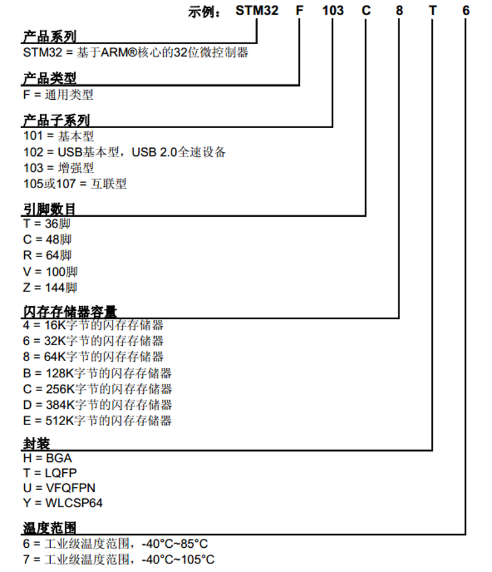
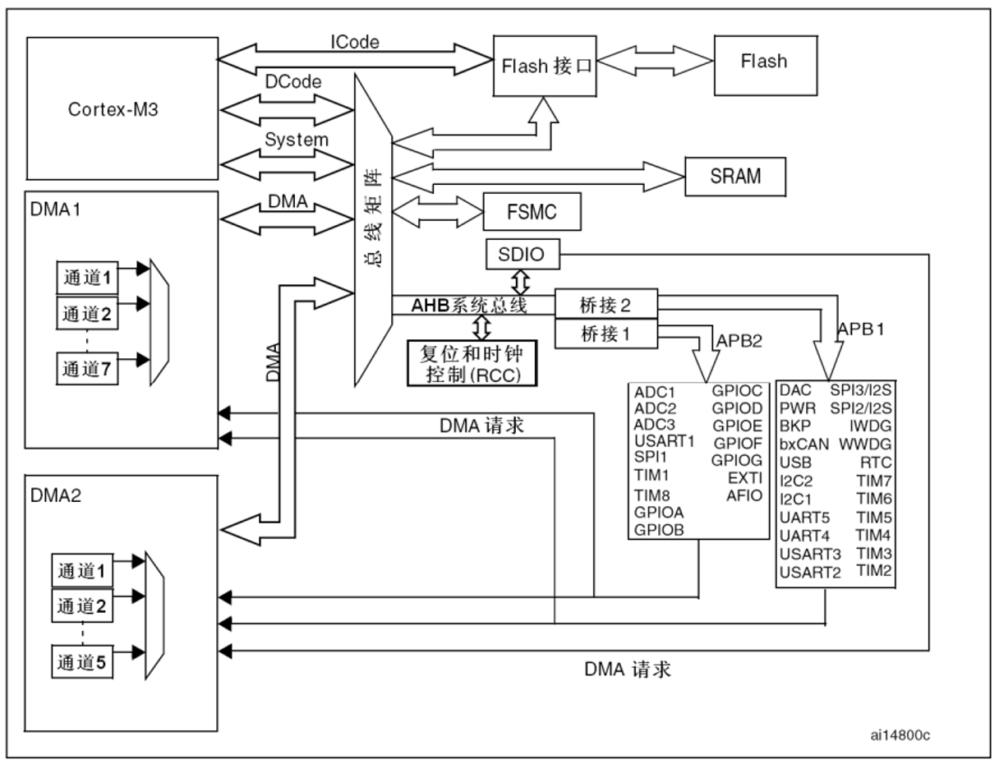
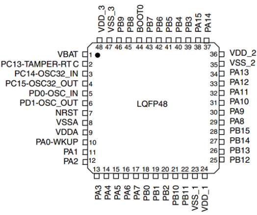
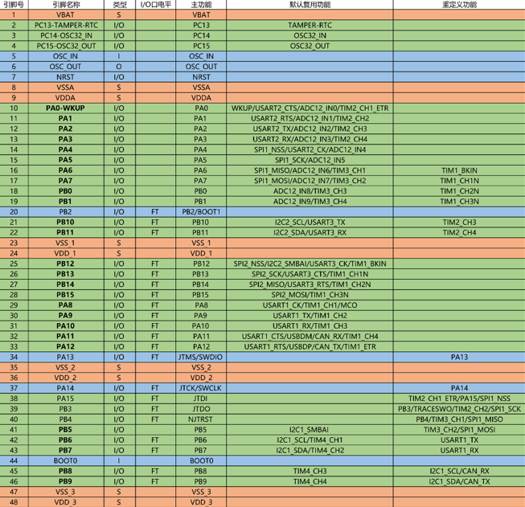
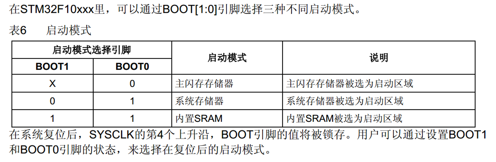
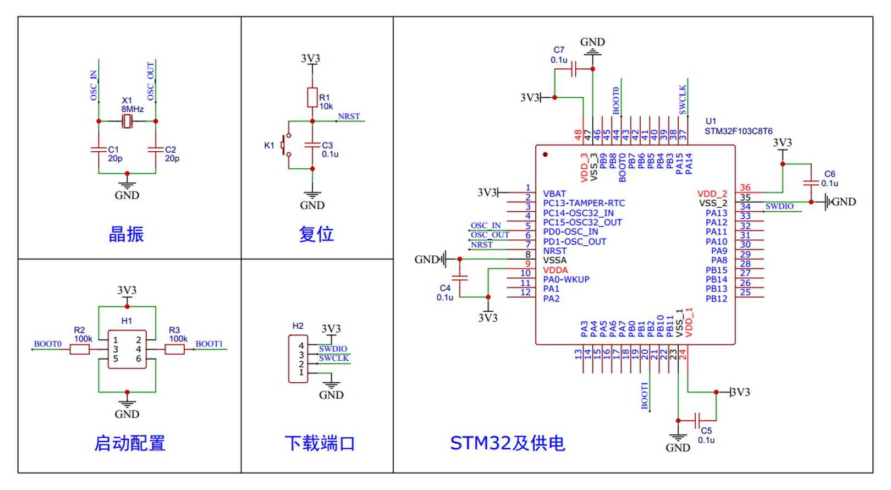
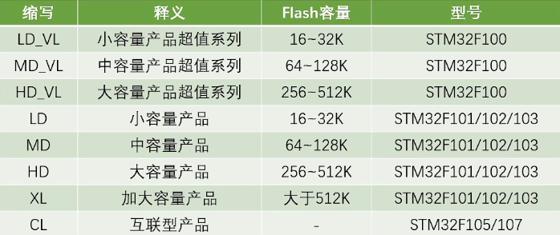

## 片上资源/外设

| 英文缩写        | 名称        | 英文缩写    | 名称        |
| ----------- | --------- | ------- | --------- |
| ==NVIC==    | 嵌套向量中断控制器 | CAN     | CAN通信     |
| ==SysTick== | 系统滴答定时器   | USB     | USB通信     |
| RCC         | 复位和时钟控制   | RTC     | 实时时钟      |
| GPIO        | 通用IO口     | CRC     | CRC校验     |
| AFIO        | 复用IO口     | PWR     | 电源控制      |
| EXTI        | 外部中断      | BKP     | 备份寄存器     |
| TIM         | 定时器       | IWDG    | 独立看门狗     |
| ADC         | 模数转换器     | WWDG    | 窗口看门狗     |
| DMA         | 直接内存访问    | DAC     | 数模转换器     |
| USART       | 同步/异步串口通信 | SDIO    | SD卡接口     |
| I2C         | I2C通信     | FSMC    | 可变静态存储控制器 |
| SPI         | SPI通信     | USB OTG | USB主机接口   |

> [!INFO]
> DAC、SDIO、FSMC、USB OTG 在部分 STM32 型号中不存在，具体见各型号说明

## 命名规则

## 系统结构

## STM32F103C8T6 引脚定义

**接线使用首先就要把电源部分和最小系统部分的电路连接好，即表中红色、蓝色部分**

> [!NOTE]
> - 1 号引脚 VBAT 是*备用电池供电*的引脚，可接如 3V 的电池给内部 RTC 时钟和备份寄存器提供电源
> - I/O 口可根据程序*输出或读取*高低电平，最常用
> - 2 号引脚为 I/O 口或侵入检测或 RTC，侵入检测可做安全保障的功能，RTC 可以用来输出 RTC 校准时钟、闹钟脉冲等
> - 3、4 号引脚是 I/O 口或接 32.768KHz 的 RTC 晶振
> - 5、6 号引脚接*系统主晶振*，一般 8MHz，最终产生 72MHz 的频率作为系统主时钟
> - 7 号引脚是*系统复位引脚*，N 代表低电平复位
> - 8、9 号引脚为*内部模拟部分电源*，如 ADC、RC 振荡器，VSS 负极接 GND，VDD 正极接 3.3V
> - 10-19 号引脚都为 I/O 口，PA0 兼具 WKUP 功能*唤醒待机*模式的 STM32
> - 20 号引脚为 I/O 口或 BOOT1 引脚，*后者用来配置启动模式*
> - 23、24 号引脚的 VSS_1、VDD_1 以及后面的 VSS、VDD 等都为*系统主电源口*，VSS 负极接 GND，VDD 正极接 3.3V
> - 34、37-40 号引脚为 I/O 口或调试端口，后者用于*调试程序、下载程序*，此 STM32 支持 SWD、JTAG 两种调试方式，SWD 需要 SWDIO、SWCLK 两根线，JTAG 需要 JTMS、JTCK、JTDI、JTDO、NJTRST 五根线，**STLINK 用 SWD 方式，只需占用 PA13、PA14**
> - 44 号引脚为 BOOT0 也用来做*启动配置*

## 启动配置

作用：指定程序开始运行的位置，一般情况下程序在 Flash 程序存储器开始运 行

> 第一种模式是最常用的默认配置，第二种模式用作串口下载程序（不使用上面 5 个调试口），第三种模式用作程序调试，使用较少

## 最小系统电路

最小系统电路是 STM32 正常工作的最基本电路

> [!ADDITION]
> 电源和 GND 之间一般会连接一个滤波电容，用于保证供电电压的稳定

## 启动文件分类

