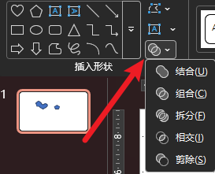
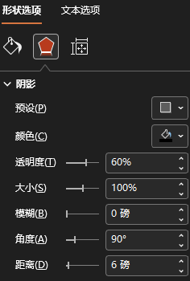
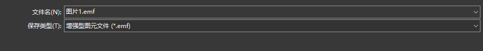

图标库：[iconfont.cn](https://www.iconfont.cn/collections/index)
配色方案：[colordrop.io](https://colordrop.io/)

- ==图形的组合操作==
	选择多个图形后->形状格式->插入形状
	

- ==图形阴影==：
	选择图形后->右键选设置对象格式->形象选项->效果->阴影
	

- ==文字转形状==：
	1.随意绘制一个形状放在文本框之外的区域，后按住shift选中文本框再选中形状，形状格式中进行剪除操作
	2.形状盖住文本框，再拖拽全选中文本框和形状，形状格式中进行拆分操作（这样可以把文字的笔画也拆分开）

- ==图表转形状==：
	选中图表右键另存为图片：（增强型图元文件）
	
	后插入，右键组合->取消组合，再重复一次组合->取消组合