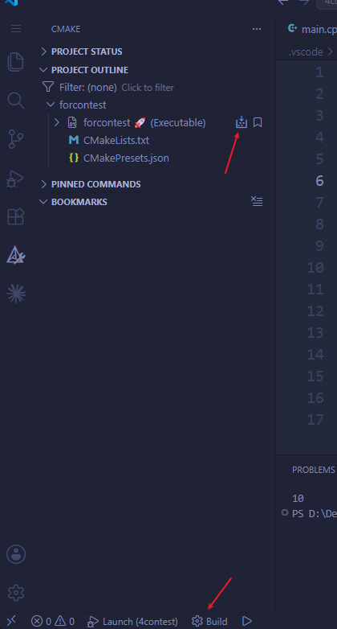
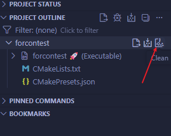

使用的 LSP：

 > Clangd、CodeLLDB、CMake Tools 插件，GCC（带 LLVM/Clang）
 
 编译器位置：

> ~/mingw64/bin

将该地址添加到环境变量->系统变量->Path 中

## 编译

写好源码文件后，在 vscode 界面按 `Ctrl+Shift+P` 进入命令选择 *Cmake 引导（Cmake:Quick Start）*，填入生成文件名等操作，选择要参与编译的文件，选择 Clang 编译器预设

> [!NOTE] 文件过程
> 在*选好预设之前*在项目根目录下生成好了 `CmakeLists.txt` 文件，后续如果想再加入新的源码文件可在 `add_executable` 函数中添加
> *选好预设之后*会生成 `CMakePresets.json` 预设文件，包含使用的编译器、生成项目文件的路径信息等

在活动栏进入 *CMake->PROJECT OUTLINE* 找到可执行文件（项目文件）点击 build，或者在*左下角状态栏点击 build* 即可构建源文件（默认所有目标）



> [!NOTE]
> 状态栏中的 build 也可用快捷键 `F7`

运行时，对 CMake 已构建的文件*右键->在终端打开*即可，或者用快捷键 `Ctrl+F5` 即不调试直接运行

## 调试

在活动栏 Run and Debug 选择创建 launch 文件，通过 *CodeLLDB* 创建，此时在项目根目录生成 `.vscode` 文件夹下 `launch.json` 文件，格式如下：

```json
{
    // Use IntelliSense to learn about possible attributes.
    // Hover to view descriptions of existing attributes.
    // For more information, visit: https://go.microsoft.com/fwlink/?linkid=830387
    "version": "0.2.0",
    "configurations": [
        {
            "name": "Launch",
            "type": "lldb",
            "request": "launch",
            "program": "${workspaceRoot}/<your program>",
            "args": [],
            "cwd": "${workspaceRoot}"
        }
    ]
}
```

> 由于 CMake 生成项目在 out/build/<预设名>中，故*上面"program"项中需要修改*，可以改为`${command:cmake.launchTargetPath}`

创建完 launch 文件后，按 `F5` 即可开始调试，可以自己选择断点

> [!NOTE]
> 如果未创建 launch 文件就按 `F5`，也会自动生成 launch.json 文件并跳转到该文件，此时再修改并按 `F5` 即可调试

## 构建工具

创建的 CMakePresets.json 文件内容为：

```json
{
    "version": 8,
    "configurePresets": [
        {
            "name": "Clang 19.1.7 x86_64-w64-windows-gnu",
            "displayName": "Clang 19.1.7 x86_64-w64-windows-gnu",
            "description": "正在使用编译器: C = C:\\mingw64\\bin\\clang.exe, CXX = C:\\mingw64\\bin\\clang++.exe",
            "generator": "MinGW Makefiles",
            "binaryDir": "${sourceDir}/out/build/${presetName}",
            "cacheVariables": {
                "CMAKE_INSTALL_PREFIX": "${sourceDir}/out/install/${presetName}",
                "CMAKE_C_COMPILER": "C:/mingw64/bin/clang.exe",
                "CMAKE_CXX_COMPILER": "C:/mingw64/bin/clang++.exe",
                "CMAKE_BUILD_TYPE": "Debug"
            }
        }
    ]
}
```

其中的构建工具就是 generator，除了使用 MinGW Makefiles 还可用 Ninja，*速度更快*，一般来说可选择使用 **Ninja**

如果要从 WinGW 改为 Ninja，记得在 CMake 插件中 Clean 去掉原有的构建文件

